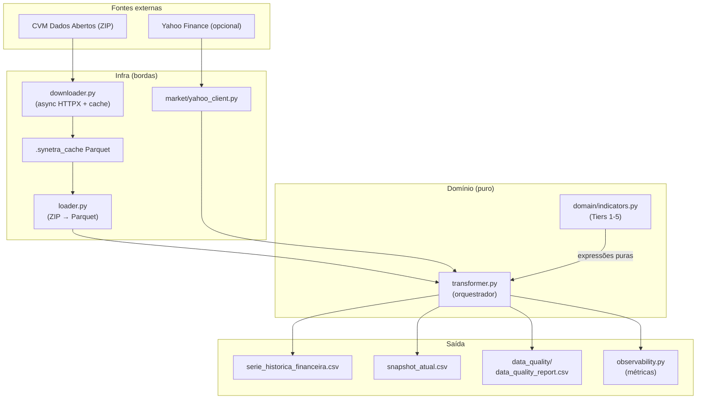

# Synetra

[Leia em Português](README.md) · [Read in English](README_EN.md)

> Pipeline ETL para análise fundamentalista de dados da CVM. Polars no motor, Domain-Driven Design na estrutura.


---

## O que é

Synetra lê os arquivos brutos da CVM (DFP e FRE de 2010 em diante), aplica regras contábeis por setor (industrial, financeiro, seguradora) e devolve uma série histórica larga com indicadores fundamentalistas prontos para análise quantitativa.

A lógica financeira é pura e vive isolada em `synetra/domain/`. Download, cache e I/O ficam nas bordas do sistema. Isso deixa as fórmulas fáceis de testar e auditar uma por uma.

Opcionalmente, anexa cotações da B3 via Yahoo Finance para calcular múltiplos históricos (P/L, P/VP, Market Cap) e um snapshot do pregão mais recente.

## Índice

- [Stack](#stack)
- [O que o pipeline entrega](#o-que-o-pipeline-entrega)
- [Arquitetura](#arquitetura)
- [Pré-requisitos](#pré-requisitos)
- [Como executar](#como-executar)
- [Configuração (`config.toml`)](#configuração-configtoml)
- [Estrutura do projeto](#estrutura-do-projeto)
- [Indicadores calculados](#indicadores-calculados)
- [Testes e qualidade](#testes-e-qualidade)
- [Performance](#performance)
- [Outputs](#outputs)
- [Documentação adicional](#documentação-adicional)

## Stack

| Camada | Tecnologia |
|---|---|
| Linguagem | Python 3.12+ |
| Motor de dados | Polars 1.40+ (Rust) |
| HTTP assíncrono | httpx 0.28+ |
| Validação de config | Pydantic 2.13+ |
| Logging estruturado | loguru |
| Cotações | yfinance |
| Gerenciador | uv |
| Qualidade | ruff · mypy strict · pytest · hypothesis · bandit · pip-audit |

## O que o pipeline entrega

- Série histórica larga em CSV (`TICKER × ANO × indicadores`) de 2010 até o último exercício disponível.
- Snapshot atual com preço do último pregão e múltiplos recalculados (`snapshot_atual.csv`).
- Relatório de qualidade de dados por ticker (`data_quality_report.csv`).
- Auditoria temporal automática (gaps, outliers de ROE, receita zerada).
- Métricas de execução por etapa via `PipelineMetrics` (tempo, linhas processadas, cobertura de mercado).

## Arquitetura



Três princípios mandam na estrutura:

1. **Domínio isolado.** Tudo em `synetra/domain/` é função pura de expressões Polars. Nenhum I/O, nenhuma dependência de config.
2. **Bordas estreitas.** Downloader, loader e yahoo_client são os únicos módulos que falam com a rede ou disco.
3. **Config imutável.** O `config.toml` é lido uma vez, validado com Pydantic (`frozen=True`) e passa adiante por injeção.

## Pré-requisitos

- Python 3.12 ou superior
- [uv](https://github.com/astral-sh/uv) para gerenciar o ambiente
- ~500 MB de espaço em disco para o cache Parquet (16 anos de DFP + FRE)
- Conexão para o primeiro download. Depois disso o cache cobre tudo.

## Como executar

```bash
# 1. Instalar dependências
uv sync

# 2. Ajustar alvos em config.toml (anos, tickers, setores)
#    O mapa Ticker → CNPJ fica em mapa_tickers.csv

# 3. Rodar o pipeline
uv run python main.py
```

Saídas aparecem na raiz:
- `serie_historica_financeira.csv`
- `snapshot_atual.csv` (se `[market].enabled = true`)
- `data_quality_report.csv`
- `synetra.log` (rotação em 10 MB)

### Comandos úteis

```bash
uv run pytest                     # suíte completa
uv run pytest -k indicators       # testes por palavra-chave
uv run ruff check .               # lint
uv run ruff format .              # formatação
uv run mypy synetra               # type check strict
uv run bandit -r synetra          # scanner de segurança
uv run pip-audit                  # CVEs nas dependências
```

## Configuração (`config.toml`)

O arquivo está dividido em blocos. Cada um é validado por um modelo Pydantic em `synetra/config.py`.

| Bloco | Função |
|---|---|
| `[urls]` | Patterns das URLs CVM (precisam conter `{year}`) |
| `[pipeline]` | Tipos de documento, anos, concorrência, force refresh |
| `[market]` | Ativa Yahoo Finance e parâmetros de cache/batch |
| `[contas.industrial]` | Mapa código contábil CVM → nome canônico (empresas industriais) |
| `[contas.financeiro]` | Idem para bancos e instituições de crédito |
| `[contas.seguradora]` | Idem para seguradoras e capitalização |
| `[setores]` | Palavras-chave que classificam o setor de cada empresa |
| `[regex]` | Regex para detectar contas especiais (depreciação, capex, dividendos) |

Exemplo mínimo:

```toml
[pipeline]
doc_types = ["DRE", "BPA", "BPP", "DFC_MI", "DFC_MD"]
years_start = 2010
years_end = 2026
max_workers = 5
force_refresh = false

[market]
enabled = true
cache_max_age_days = 7
batch_size = 100
```

Config com problema aborta o pipeline antes de qualquer I/O. Erros aparecem com mensagem clara de qual campo falhou.

## Estrutura do projeto

```
Projeto_CVM/
├── synetra/
│   ├── __init__.py            # versão pública, API re-exportada
│   ├── config.py              # modelos Pydantic + load_config()
│   ├── downloader.py          # HTTP async, cache por Last-Modified
│   ├── loader.py              # CSV da CVM → Parquet (DFP + FRE)
│   ├── transformer.py         # orquestrador do cálculo
│   ├── observability.py       # PipelineMetrics + timed_step()
│   ├── utils.py               # helpers vetorizados (texto, display)
│   ├── py.typed               # marker PEP 561
│   ├── domain/                # camada de domínio (funções puras)
│   │   ├── __init__.py
│   │   └── indicators.py      # Tiers 1-5, Altman Z'', helpers de expressão
│   ├── market/                # integração com cotações
│   │   ├── yahoo_client.py    # download + cache de OHLCV
│   │   └── price_aggregator.py# snapshot + valuation histórica
│   └── data_quality/          # auditoria pós-pipeline
│       ├── checks.py          # regras individuais (stale, delisted, ...)
│       ├── models.py          # enums de severidade e tipos de flag
│       └── report.py          # agrega e gera CSV
│
├── tests/                     # 19 módulos, ~80 testes (pytest + hypothesis)
├── docs/                      # WIKI.md, index.md, stylesheets/
├── .github/workflows/         # ci.yml, docs.yml
├── .synetra_cache/            # cache Parquet (gerado no primeiro run)
├── scratch/                   # scripts experimentais (ignorados pelo lint)
│
├── main.py                    # ponto de entrada (asyncio.run)
├── config.toml                # configuração do pipeline
├── mapa_tickers.csv           # Ticker ↔ CNPJ ↔ razão social
├── mkdocs.yml                 # build da documentação
├── pyproject.toml             # deps + ruff/mypy/pytest/coverage
└── uv.lock                    # lockfile reproduzível
```

## Indicadores calculados

Todos os indicadores vivem em `synetra/domain/indicators.py` como funções puras. São aplicados em cinco tiers com dependência em cadeia.

| Tier | Indicadores |
|---|---|
| **1 — Rentabilidade e bases** | ROE, ROA, LPA, VPA, Giro do Ativo, Alavancagem LP, Accruals, Accrual Ratio, GP/A, Margens (Bruta, EBIT, Líquida) |
| **2 — Fluxo de caixa** | FCL, Payout, EBITDA |
| **3 — Estrutura de capital** | Margem EBITDA, Dívida Total, Liquidez Corrente |
| **4 — Alavancagem** | Dívida Líquida, Dívida/PL |
| **5 — Ratios finais** | DL/EBITDA, ROIC (Damodaran), Altman Z''-Score EMS |

Em cima dos tiers, o `transformer.py` calcula ainda:

- **Piotroski F-Score** — qualidade de lucros, 9 critérios, só setor industrial.
- **Beneish M-Score** — detecção de manipulação contábil, 8 termos, só industrial.
- **Crescimento** — YoY e CAGR 3a/5a para receita e lucro.
- **Fatores quantitativos** — estabilidade de lucros, volatilidade de ROE, delta ROE, delta margem, cash conversion.
- **Eficiência operacional** — Margem FCO, Margem FCL, CASH_ROA, PMR, Capital de Giro, ROCE, NOPAT, Reinvestment Rate, Sustainable Growth, Cash Ratio.

Se houver cotações (Yahoo ativado):

- **Valuation histórico anual** — P/L, P/VP, Market Cap usando o fechamento do último pregão do ano.
- **Snapshot atual** — P/L, P/VP e Market Cap usando o preço do último pregão disponível.

### Assepsia setorial

Bancos e seguradoras têm contabilidade própria. Métricas industriais que não fazem sentido nesses setores são explicitamente `null`, não zero. Isso evita que rankings agreguem empresas com base em métrica que não se aplica a elas.

| Setor | Métricas anuladas |
|---|---|
| Bancos | EBITDA, margens operacionais, CAPEX, ROIC, liquidez, todas as métricas de dívida, contas a receber comerciais, cash conversion, PMR, ROCE, NOPAT |
| Seguradoras | Margem Bruta, ROIC, Liquidez Corrente, ratios de dívida |

## Testes e qualidade

- **80 testes** distribuídos em 19 módulos: unitários, integração, property-based (hypothesis), mocked I/O.
- **mypy strict** no código de produção. Scratch e testes ficam fora.
- **ruff** com bugbear, simplify, comprehensions, pyupgrade e isort habilitados.
- **CI GitHub Actions** roda lint, type check e testes a cada push.
- **Cobertura** via `pytest-cov` configurada em `pyproject.toml`.

Os testes de domínio (`test_indicators.py`, `test_transformer_formulas.py`) cobrem cada fórmula isoladamente, inclusive casos de denominador zero e segregação por setor.

## Performance

Números medidos em hardware de referência (Intel Core i3, SSD SATA, Windows 11):

| Etapa | Tempo aprox. |
|---|---|
| Download 16 anos DFP + FRE (primeiro run, rede típica) | ~30 s |
| Leitura do cache Parquet completo | < 2 s |
| Cálculo dos indicadores (Tiers 1-5 + F-Score + Beneish + quant) | ~4 s |
| Download Yahoo Finance (~350 tickers, 15 anos) | ~10 s |
| Pipeline completo com cache quente | < 10 s |
| Pipeline completo primeiro run | ~46 s |

Decisões que importam para essa margem:

- **Lazy Parquet scan** com predicate pushdown — só o subset de CNPJs alvo entra na memória.
- **Categorical dtypes** em colunas de baixa cardinalidade (CNPJ, setor, categoria, nome de conta) reduzem o footprint em ~70%.
- **Vetorização total** dos cálculos. Nenhum `apply`, nenhum loop Python sobre linhas.
- **Consolidação de shifts** num único `with_columns` permite ao Polars otimizar o plano de execução.
- **Downloads paralelos** com `asyncio.gather` + `Semaphore`. CPU-bound (parsing de CSV) vai para `run_in_executor`.

## Outputs

| Arquivo | Conteúdo |
|---|---|
| `serie_historica_financeira.csv` | Série histórica larga, separador `;`, encoding UTF-8, 2 casas decimais em valores monetários e 4 em ratios. |
| `snapshot_atual.csv` | Um registro por ticker com preço do último pregão, múltiplos recalculados e carimbo de data. |
| `data_quality_report.csv` | Flags de qualidade por ticker: sem histórico Yahoo, cotação stale, possível delistagem, IPO recente, gaps temporais. |
| `synetra.log` | Log estruturado com rotação em 10 MB. |

## Documentação adicional

- [Wiki técnica detalhada](docs/WIKI.md) — fórmulas, decisões de modelagem, exemplos de análise. [English version](docs/WIKI_EN.md).
- [README em inglês](README_EN.md).
- Código do domínio (`synetra/domain/indicators.py`) e do transformer (`synetra/transformer.py`) têm docstrings extensas com a derivação de cada indicador.
