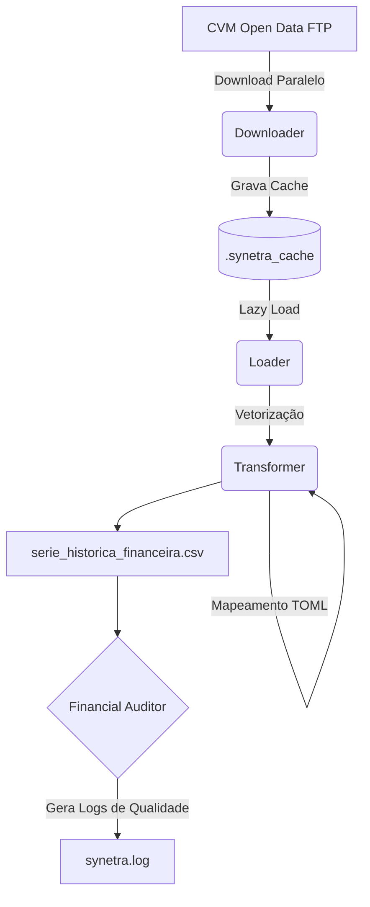

# 🌌 Synetra (v1.0.0)
[Leia em Português] | [Read in English](README_EN.md)
> **Financial Intelligence Pipeline** | ETL de alta performance para dados da CVM com Polars.


---

### 🌐 [PT-BR] Português

O **Synetra** é um motor de processamento de dados financeiros desenhado para extrair, limpar e transformar o volume massivo de dados brutos da CVM (Comissão de Valores Mobiliários) em uma base de indicadores fundamentalistas pronta para análise institucional.

A versão **1.0.0** é construída com engenharia de alto nível, operando como um produto de dados robusto com tipagem estrita (Pydantic), suíte de testes (TDD) e um motor nativo em Rust/Polars.

#### ⚡ Performance (Benchmark v1.0.0)
O coração do Synetra utiliza padrões de *Single-Evaluation* e *Global Joins* do ecossistema Polars:
- **Tempo de Cálculo de 16 Anos de Dados (5.200+ registros):** ~3.2 segundos.
- **Vetorização Extrema:** Remoção total do Pandas. O motor de transformação processa todos os cálculos matemáticos nativamente na camada C++/Rust.

#### 🛠️ Destaques da Engenharia (v1.0.0)
- **Motor Vetorizado:** Processamento de alta performance utilizando Comprehensions paralelas e Joins unificados no `transformer.py`.
- **Integridade de Configuração:** Validação estrita via Pydantic para garantir que o pipeline opere apenas com parâmetros válidos.
- **Auditoria Financeira Integrada:** Detecção automática de gaps temporais e distorções matemáticas (ex: ROE anômalo) durante a execução.
- **Garantia de Qualidade (TDD):** Suíte com 38 testes unitários que validam 100% da lógica financeira e matemática do sistema.

#### 🏗️ Arquitetura do Sistema



#### 📂 Estrutura do Projeto
- `synetra/`: Pacote principal com os módulos de inteligência.
- `main.py`: O orquestrador de execução com auditoria integrada.
- `parameters.toml`: Configuração centralizada (regras de negócio e mapeamento de contas).
- `tests/`: Suíte de testes unitários para o motor financeiro.

#### 🚀 Como Executar
1. Instale as dependências: `pip install -r requirements.txt`
2. Revise/configure o mapeamento no `parameters.toml`.
3. Execute o pipeline:
   ```bash
   python main.py
   ```
4. Verifique os avisos de Data Quality no arquivo `synetra.log`.

