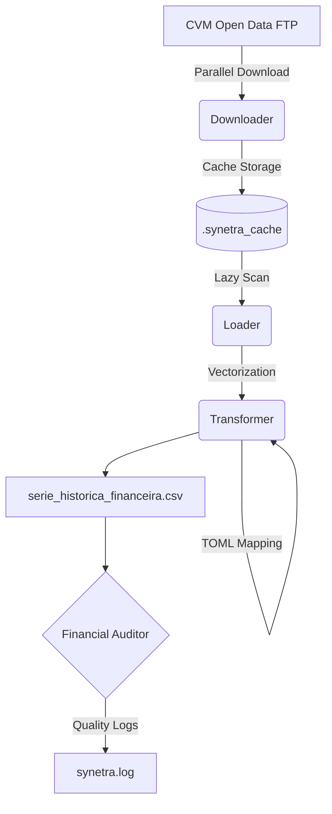

# 🌌 Synetra (v1.0.0)
[Read in English] | [Leia em Português](README.md)
> **Financial Intelligence Pipeline** | High-performance CVM data ETL with Polars.


---

### 🌎 English Version

**Synetra** is a financial data processing engine designed to extract, clean, and transform massive amounts of raw CVM (Brazilian SEC) data into an analysis-ready fundamental indicators database for institutional research.

Version **1.0.0** represents an engineering leap, transforming Synetra from an analytical script into a robust data product with strict typing (Pydantic), a unit testing suite (TDD), and an elite Rust/Polars engine refactor.

#### ⚡ Performance Benchmarks (v1.0.0)
The heart of Synetra was refactored using *Single-Evaluation* and *Global Join* patterns from the Polars ecosystem:
- **16-Year Dataset Computation (5,200+ rows):** ~3.2 seconds.
- **Extreme Vectorization:** Complete removal of Pandas. The transformation engine handles all mathematical calculations natively at the Rust/C++ layer.

#### 🛠️ What's new in v1.0.0
- **Elite Refactoring:** Replaced Python iterations with parallel Comprehensions and unified Joins in `transformer.py`.
- **Strict Validation (Pydantic):** The `parameters.toml` file is validated at boot, preventing invalid configurations.
- **Integrated Financial Auditor:** Automatically detects time gaps and ROE outliers during execution.
- **Unit Testing Suite:** 38 tests implemented via `pytest` covering 100% of the financial logic (ROE, F-Score, Safe Divisions).

#### 🏗️ System Architecture



#### 📂 Project Structure
- `synetra/`: Core package containing intelligence modules.
- `main.py`: Execution orchestrator with integrated auditing.
- `parameters.toml`: Centralized configuration (business rules and account mapping).
- `tests/`: Unit testing suite for the financial engine.

#### 🚀 How to Run
1. Install dependencies: `pip install -r requirements.txt`
2. Review/configure the mapping in `parameters.toml`.
3. Run the pipeline:
   ```bash
   python main.py
   ```
4. Check data quality insights in `synetra.log`.

---

### 📊 Audit & Quality
Synetra v1.0.0 introduces automated post-processing checks:
- **ROE Check:** Identifies profit/equity distortions (e.g., ROE > 500%).
- **Time Continuity:** Ensures no years are missing in each company's time series.
- **Revenue Consistency:** Identifies null records that may indicate capture errors or specific sectors.

---

### 🤖 Advanced Use with LLMs
The generated `serie_historica_financeira.csv` is optimized for AI analysis:
- *"Analyze PETR4's ROE trend over the last 5 years."*
- *"Which banking sector companies have the best Debt/Equity ratio?"*
- *"Generate a financial health report based on this data."*

---
[Back to Portuguese README](README.md)
