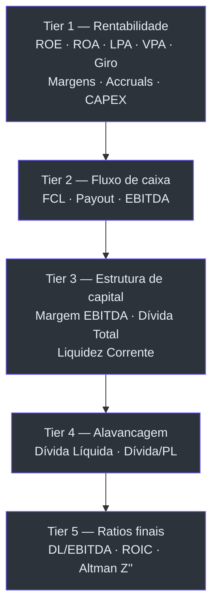

# Synetra Technical Wiki

[Leia em Português](WIKI.md) · [Read in English](WIKI_EN.md)

Referência técnica completa do pipeline ETL do Synetra: como os valores brutos da CVM viram indicadores fundamentalistas, onde cada conta é buscada, e quais regras separam empresas industriais, bancos e seguradoras.

Este documento é derivado do código real. Cada fórmula cita o arquivo e o trecho onde está implementada.

---

## Sumário

1. [Contratos e convenções](#contratos-e-convenções)
2. [Da CVM ao indicador — visão geral](#da-cvm-ao-indicador--visão-geral)
3. [Mapeamento de contas por setor](#mapeamento-de-contas-por-setor)
4. [Classificação setorial](#classificação-setorial)
5. [Detecção de contas especiais (regex)](#detecção-de-contas-especiais-regex)
6. [Pivot e consolidações](#pivot-e-consolidações)
7. [Resolução do Lucro Líquido](#resolução-do-lucro-líquido)
8. [Indicadores por tier (domain layer)](#indicadores-por-tier-domain-layer)
9. [Piotroski F-Score](#piotroski-f-score)
10. [Beneish M-Score](#beneish-m-score)
11. [Crescimento — YoY e CAGR](#crescimento--yoy-e-cagr)
12. [Fatores quantitativos (Quality · Momentum · Risk)](#fatores-quantitativos-quality--momentum--risk)
13. [Eficiência operacional e qualidade](#eficiência-operacional-e-qualidade)
14. [Valuation — histórico e snapshot atual](#valuation--histórico-e-snapshot-atual)
15. [Assepsia setorial — resumo consolidado](#assepsia-setorial--resumo-consolidado)
16. [Auditoria e Data Quality](#auditoria-e-data-quality)
17. [Arredondamentos e tipos de saída](#arredondamentos-e-tipos-de-saída)
18. [Referência cruzada de arquivos](#referência-cruzada-de-arquivos)

---

## Contratos e convenções

Antes das fórmulas, os contratos que mantêm o pipeline previsível.

| Convenção | Regra | Motivo |
|---|---|---|
| Domínio puro | Tudo em `synetra/domain/` opera só com expressões Polars. Sem I/O, sem config. | Facilita teste isolado por fórmula. |
| Config imutável | `SynetraConfig` é `frozen=True`. Valida antes de qualquer I/O. | Config quebrada aborta cedo, não no meio do pipeline. |
| Valores monetários | Escala `MIL` do CSV CVM é multiplicada por 1000 para virar unidade (R$). | `synetra/loader.py → _apply_monetary_scale`. |
| Divisão segura | Denominador zero ou nulo retorna `None`, nunca `inf` ou `NaN`. | `synetra/domain/indicators.py → safe_div`. |
| Tipos de saída | Ratios com 4 casas decimais, valores monetários com 2, Market Cap sem decimais. | `synetra/transformer.py → _COLS_ROUND_4D/_COLS_ROUND_2D`. |
| Assepsia setorial | Métrica que não se aplica a um setor é `null`, não zero. | Evita rankings misturarem empresas em métrica irrelevante. |

### Notação usada

- Expressões em LaTeX ($\cdot$) para matemática.
- Blocos ```python``` quando é essencial mostrar a expressão Polars.
- `null` significa `None` (Polars) — explicitamente ausente, diferente de zero.
- "Categoria" se refere ao enum `Categoria` (`INDUSTRIAL`, `FINANCEIRO`, `SEGURADORA`).

---

## Da CVM ao indicador — visão geral

O pipeline completo faz quatro travessias sobre os dados da CVM antes de produzir a série histórica. Cada travessia adiciona informação sem reescrever o que veio antes.


Os 11 passos do `FinancialTransformer.calculate_indicators` (em `synetra/transformer.py`):

| # | Passo | Responsabilidade |
|---|---|---|
| 1 | `_prepare_history` | Projection pushdown + setores + regex + mapa de contas |
| 2 | `_pivot_and_consolidate` | Pivot, fill, consolidação de caixa, resolução de lucro, merge FRE |
| 3 | `calculate_all_indicators` | Tiers 1 a 5 (domain layer) |
| 4 | `_merge_tickers` | Join com `mapa_tickers.csv` + seleção de colunas |
| 5 | `_apply_sector_assepsia` | Anulação de métricas industriais para bancos/seguradoras |
| 6 | `_prepare_shifts` | Geração de colunas `_prev`, `_BASE`, rolling stats num único `with_columns` |
| 7 | `_calculate_fscore` | Piotroski F-Score (9 critérios, industrial) |
| 8 | `_calculate_beneish` | Beneish M-Score (8 termos, industrial) |
| 9 | `_calculate_growth_and_quant` | YoY, CAGR, 5 fatores quantitativos |
| 10 | `_calculate_efficiency_and_quality` | 10 indicadores de eficiência |
| 11 | `_round_and_finalize` | Drop auxiliares + arredondamento + rename público |

---

## Mapeamento de contas por setor

Os códigos de conta (`CD_CONTA`) da CVM mudam de significado dependendo do setor. Um banco usa `3.09` para lucro líquido; uma indústria usa `3.11`. O Synetra mantém três mapas independentes em `config.toml` e aplica o mapa correto depois da classificação setorial.

A junção é feita com um **single join global** em `synetra/transformer.py → map_accounts`: todos os mapas viram um único DataFrame de lookup com `(CATEGORIA, CD_CONTA) → CONTA_NOME`, e um `join` resolve tudo de uma vez — sem loops Python.

### Industrial — `config.toml [contas.industrial]`

| Código CVM | Nome interno | O que representa |
|---|---|---|
| `1` | `ATIVO_TOTAL` | Soma total de ativos (circulante + não circulante) |
| `1.01` | `ATIVO_CIRCULANTE` | Ativos de curto prazo (caixa, receber, estoques) |
| `1.01.01` e `1.01.02` | `CAIXA_EQUIVALENTES` | Caixa e equivalentes (duas linhas agregadas via `sum`) |
| `1.01.03` | `CONTAS_A_RECEBER` | Clientes (trade receivables) |
| `1.02` | `ATIVO_NAO_CIRCULANTE` | Ativos de longo prazo |
| `1.02.03` | `IMOBILIZADO` | PP&E (Property, Plant & Equipment) |
| `2.01` | `PASSIVO_CIRCULANTE` | Dívidas e obrigações de curto prazo |
| `2.01.04` | `DIVIDA_CP` | Empréstimos e financiamentos de curto prazo |
| `2.02.01` | `DIVIDA_LP` | Empréstimos e financiamentos de longo prazo |
| `2.03` | `PATRIMONIO_LIQUIDO` | PL da controladora |
| `3.01` | `RECEITA_LIQUIDA` | Receita operacional líquida |
| `3.03` | `RESULTADO_BRUTO` → `LUCRO_BRUTO` | Receita − CPV |
| `3.04` | `DESPESAS_OPERACIONAIS` | Despesas gerais, administrativas e de vendas |
| `3.05` | `EBIT` | Resultado operacional |
| `3.09` | `LUCRO_LIQUIDO_BCO` | Fallback (uso para indústrias que usem layout bancário) |
| `3.09.01` | `LUCRO_CONTROLADORA_BCO` | Fallback de controladora |
| `3.11` | `LUCRO_LIQUIDO` | Lucro líquido consolidado |
| `3.11.01` | `LUCRO_CONTROLADORA` | Lucro líquido da controladora (fonte preferida) |
| `6.01` | `FCO` | Fluxo de caixa das atividades operacionais |
| `6.02` | `FCI` | Fluxo de caixa das atividades de investimento |
| `6.03` | `FCF` | Fluxo de caixa das atividades de financiamento |

### Financeiro (bancos) — `config.toml [contas.financeiro]`

Bancos não têm `ATIVO_CIRCULANTE`/`PASSIVO_CIRCULANTE` no sentido industrial. O layout bancário da CVM expõe o PL em contas diferentes.

| Código CVM | Nome interno | Observação |
|---|---|---|
| `1` | `ATIVO_TOTAL` | |
| `1.01.01` | `CAIXA_EQUIVALENTES` | |
| `1.01.08` | `CONTAS_A_RECEBER` | Operações de crédito a clientes |
| `1.06` | `IMOBILIZADO` | |
| `2.01` | `PASSIVO_CIRCULANTE` | Exigível a curto prazo |
| `2.07` e `2.08` | `PATRIMONIO_LIQUIDO` | Duas contas agregadas — PL do grupo bancário |
| `3.01` | `RECEITA_LIQUIDA` | Receita de intermediação financeira |
| `3.03` | `RESULTADO_BRUTO` → `LUCRO_BRUTO` | |
| `3.04` | `DESPESAS_OPERACIONAIS` | |
| `3.05` | `EBIT` | |
| `3.09` | `LUCRO_LIQUIDO` | **Layout bancário**: conta principal |
| `3.09.01` | `LUCRO_CONTROLADORA` | Fonte preferida para LPA de bancos |
| `3.11` e `3.11.01` | `LUCRO_LIQUIDO_BCO` / `LUCRO_CONTROLADORA_BCO` | Fallbacks |
| `6.01`, `6.02`, `6.03` | `FCO`, `FCI`, `FCF` | |

### Seguradora — `config.toml [contas.seguradora]`

Seguradoras têm aplicações financeiras massivas. O Synetra consolida caixa + aplicações de curto e longo prazo num único `CAIXA_EQUIVALENTES` para refletir a liquidez real.

| Código CVM | Nome interno |
|---|---|
| `1` | `ATIVO_TOTAL` |
| `1.01` | `ATIVO_CIRCULANTE` |
| `1.01.01` | `CAIXA_EQUIVALENTES` |
| `1.01.02` | `APLICACOES_CP` (somado ao caixa em pós-pivot) |
| `1.01.03` | `CONTAS_A_RECEBER` |
| `1.02` | `ATIVO_NAO_CIRCULANTE` |
| `1.02.01.01` | `APLICACOES_LP` (somado ao caixa em pós-pivot) |
| `1.02.03` | `IMOBILIZADO` |
| `2.01` | `PASSIVO_CIRCULANTE` |
| `2.03` | `PATRIMONIO_LIQUIDO` |
| `3.01` e `3.01.01` | `RECEITA_LIQUIDA` |
| `3.03` | `RESULTADO_BRUTO` → `LUCRO_BRUTO` |
| `3.04` | `DESPESAS_OPERACIONAIS` |
| `3.09`, `3.09.01` | `LUCRO_LIQUIDO_BCO`, `LUCRO_CONTROLADORA_BCO` |
| `3.11`, `3.11.01` | `LUCRO_LIQUIDO`, `LUCRO_CONTROLADORA` |
| `6.01`, `6.02`, `6.03` | `FCO`, `FCI`, `FCF` |

---

## Classificação setorial

A categoria de uma empresa é decidida por keywords no campo `SETOR_ATIV` do cadastro CVM.

Arquivo: `synetra/transformer.py → classify_sectors`.

```python
if SETOR_ATIV contém qualquer keyword de [setores.financeiro]:
    CATEGORIA = FINANCEIRO
elif SETOR_ATIV contém qualquer keyword de [setores.seguradora]:
    CATEGORIA = SEGURADORA
else:
    CATEGORIA = INDUSTRIAL
```

Keywords ativas em `config.toml`:

| Categoria | Keywords |
|---|---|
| Financeiro | `BANCO`, `ARRENDAMENTO`, `FACTORING`, `CREDITO`, `SECURITIZACAO` |
| Seguradora | `SEGURO`, `SEGURADORA`, `PREVIDENCIA`, `CAPITALIZACAO` |
| Industrial | (fallback — qualquer empresa que não bata nas regras acima) |

A comparação é case-insensitive (o prefixo regex `(?i)` é prepended em tempo de execução) e usa `str.contains`, então "BANCO DO BRASIL" e "BCO DO BRASIL" casam.

---

## Detecção de contas especiais (regex)

Três tipos de conta não seguem um código fixo — o nome muda entre empresas. A CVM permite a descrição (`DS_CONTA`) como texto livre dentro da DFC. O Synetra normaliza o texto (uppercase sem acento) e aplica regex para extrair:

Arquivo: `synetra/transformer.py → detect_special_accounts`.
Regex em `config.toml [regex]`.

| Conta virtual | Prefixo CVM | Regex na descrição | Exclusões |
|---|---|---|---|
| `DEPREC_AMORT` | `6.01` (FCO) | `DEPRECIA\|AMORTIZA` | não pode conter `AJUSTE` ou `JUROS` |
| `CAPEX_VAL` | `6.02` (FCI) | `AQUISIC\|ADIC\|COMPRA` **E** `IMOBILIZADO\|INTANGIVEL` | — |
| `DIVIDENDOS_PAGOS` | `6.03` (FCF) | `DIVIDENDO\|JURO SOBRE CAPITAL\|JUROS SOBRE CAPITAL\|JURO S CAPITAL\|JUROS S CAPITAL\|JCP` | — |
| `EBIT` (seguradora) | qualquer | `RESULTADO ANTES DO RESULTADO FINANCEIRO\|RESULTADO ANTES DAS RECEITAS` | só aplica quando `CATEGORIA = SEGURADORA` |

A normalização do texto acontece em `synetra/utils.py → clean_text_expr`: remove acentos (ÁÀÂÃÄ → A, etc), uppercase e strip, tudo via expressões Polars nativas (motor Rust, sem overhead Python).

---

## Pivot e consolidações

Depois de mapear códigos para nomes, o DataFrame ainda está em formato longo (uma linha por conta). O pivot transforma em formato largo (uma coluna por conta).

Arquivo: `synetra/transformer.py → _pivot_and_consolidate`.

### Otimização de memória

Antes do pivot, colunas de baixa cardinalidade são convertidas para `Categorical`:
`CNPJ_CIA`, `CATEGORIA`, `SETOR_ATIV`, `CONTA_NOME`. Em um dataset com ~380 tickers × 16 anos, isso reduz o footprint de memória em torno de 70%.

### Pivot

```python
pivot(
    values="VL_CONTA",
    index=["CNPJ_CIA", "ANO", "CATEGORIA", "SETOR_ATIV"],
    on="CONTA_NOME",
    aggregate_function="sum",
)
```

A agregação `sum` é necessária porque algumas contas aparecem em múltiplas linhas do CSV (ex: `1.01.01` e `1.01.02` ambos mapeiam para `CAIXA_EQUIVALENTES` no layout industrial).

### Fill de colunas ausentes

Após o pivot, `_ensure_all_account_columns` garante que todas as colunas esperadas existam. Se um setor nunca teve uma conta específica num ano, a coluna é criada com `0.0`. Isso evita `KeyError` nos cálculos downstream.

### Consolidação de caixa (seguradoras)

$$
\text{CAIXA\_EQUIVALENTES}_{\text{seguradora}} = \text{Caixa} + \text{Aplicações CP} + \text{Aplicações LP}
$$

Para os outros setores, `CAIXA_EQUIVALENTES` fica como está.

Base: seguradoras mantêm reservas técnicas em aplicações financeiras líquidas. Ignorar isso subestima a liquidez da empresa em ordens de magnitude.

---

## Resolução do Lucro Líquido

O campo `LUCRO_FINAL` (renomeado para `LUCRO_LIQUIDO` no output) segue uma hierarquia de 4 níveis. A preferência é usar o **lucro da controladora** (exclui participação de não controladores) para alinhar LPA/P/L com o que analistas e provedores de dados reportam.

Arquivo: `synetra/transformer.py → _resolve_net_income`.

```python
LUCRO_FINAL =
    LUCRO_CONTROLADORA         se != 0   (conta 3.11.01, industrial)
    else LUCRO_CONTROLADORA_BCO se != 0  (conta 3.09.01, bancário)
    else LUCRO_LIQUIDO         se != 0   (conta 3.11, industrial consolidado)
    else LUCRO_LIQUIDO_BCO               (conta 3.09, bancário consolidado)
```

| Nível | Campo | Fonte CVM | Quando é usado |
|---|---|---|---|
| 1 | `LUCRO_CONTROLADORA` | `3.11.01` | Preferência absoluta quando existe e é não-zero |
| 2 | `LUCRO_CONTROLADORA_BCO` | `3.09.01` | Indústrias que usem layout bancário |
| 3 | `LUCRO_LIQUIDO` | `3.11` | Consolidado total (quando a empresa não reporta controladora separada) |
| 4 | `LUCRO_LIQUIDO_BCO` | `3.09` | Fallback final |

---

## Indicadores por tier (domain layer)

Todos os indicadores abaixo vivem em `synetra/domain/indicators.py` como funções puras. Rodam em cinco tiers com dependência em cadeia — um tier só pode usar colunas produzidas pelos tiers anteriores.



### Tier 1 — Rentabilidade e bases

Função: `get_tier1_expressions()`.

| Indicador | Fórmula | Setores | Contas usadas |
|---|---|---|---|
| `ROE` | $\dfrac{\text{Lucro Líquido}}{\text{Patrimônio Líquido}}$ | Todos | `LUCRO_FINAL`, `PATRIMONIO_LIQUIDO` |
| `ROA` | $\dfrac{\text{Lucro Líquido}}{\text{Ativo Total}}$ | Todos | `LUCRO_FINAL`, `ATIVO_TOTAL` |
| `LPA` | $\dfrac{\text{Lucro Líquido}}{\text{Qtde de Ações}}$ | Todos | `LUCRO_FINAL`, `QTDE_ACOES` (FRE) |
| `VPA` | $\dfrac{\text{PL}}{\text{Qtde de Ações}}$ | Todos | `PATRIMONIO_LIQUIDO`, `QTDE_ACOES` |
| `GIRO_ATIVO` | $\dfrac{\text{Receita Líquida}}{\text{Ativo Total}}$ | Todos | `RECEITA_LIQUIDA`, `ATIVO_TOTAL` |
| `ALAVANCAGEM_LP` | $\dfrac{\text{Dívida LP}}{\text{Ativo Total}}$ | Todos | `DIVIDA_LP`, `ATIVO_TOTAL` (auxiliar; removida na finalização) |
| `ACCRUALS` | $\text{Lucro Líquido} - \text{FCO}$ | Todos | `LUCRO_FINAL`, `FCO` |
| `ACCRUAL_RATIO` | $\dfrac{\text{Lucro Líquido} - \text{FCO}}{\text{Ativo Total}}$ | Industrial | `LUCRO_FINAL`, `FCO`, `ATIVO_TOTAL` |
| `GP_A` | $\dfrac{\text{Lucro Bruto}}{\text{Ativo Total}}$ | Industrial | `RESULTADO_BRUTO`, `ATIVO_TOTAL` |
| `MARGEM_EBIT` | $\dfrac{\text{EBIT}}{\text{Receita Líquida}}$ | Todos (mas anulada em bancos) | `EBIT`, `RECEITA_LIQUIDA` |
| `MARGEM_LIQUIDA` | $\dfrac{\text{Lucro Líquido}}{\text{Receita Líquida}}$ | Todos | `LUCRO_FINAL`, `RECEITA_LIQUIDA` |
| `MARGEM_BRUTA` | $\dfrac{\text{Lucro Bruto}}{\text{Receita Líquida}}$ | Todos (mas anulada em bancos/seguradoras) | `RESULTADO_BRUTO`, `RECEITA_LIQUIDA` |
| `CAPEX` | `CAPEX_VAL` (via regex) | Industrial + Seguradora | detectado pela regex no passo `detect_special_accounts` |
| `DEPREC_AMORT` | `DEPREC_AMORT` (via regex) | Industrial + Seguradora | idem |
| `PROVENTOS` | $|{\text{Dividendos Pagos}}|$ | Todos | `DIVIDENDOS_PAGOS` (regex) |

### Tier 2 — Fluxo de caixa

Função: `get_tier2_expressions()`.

**FCL — Free Cash Flow**

Tem lógica diferente por categoria. CAPEX já vem negativo na DFC, então soma equivale a subtração matemática.

$$
\text{FCL} = \begin{cases}
\text{FCO} + \text{FCI} & \text{se CATEGORIA} = \text{FINANCEIRO} \\
\text{FCO} + \text{CAPEX} & \text{caso contrário}
\end{cases}
$$

Bancos não têm CAPEX "físico"; o fluxo de investimentos inteiro (aplicações interbancárias, títulos) faz parte do core business.

**Payout**

$$
\text{PAYOUT} = \dfrac{\text{PROVENTOS}}{\text{Lucro Líquido}}
$$

Denominador zero ou negativo → `null` (via `safe_div`).

**EBITDA**

$$
\text{EBITDA} = \text{EBIT} + |\text{Depreciação e Amortização}|
$$

O `fill_null(0)` evita perder EBITDA quando a empresa não expõe D&A separadamente.

### Tier 3 — Estrutura de capital

Função: `get_tier3_expressions()`.

| Indicador | Fórmula | Setores | Observação |
|---|---|---|---|
| `MARGEM_EBITDA` | $\dfrac{\text{EBITDA}}{\text{Receita Líquida}}$ | Todos (mas anulada em bancos) | — |
| `DIVIDA_TOTAL` | $\text{Dívida CP} + \text{Dívida LP}$ (industrial) $\mid$ $0$ (seguradora) $\mid$ `null` (financeiro) | varia | Bancos têm "dívida" como matéria-prima, não operacional |
| `LIQUIDEZ_CORRENTE` | $\dfrac{\text{Ativo Circulante}}{\text{Passivo Circulante}}$ | Industrial | `null` para bancos e seguradoras |

Renomeada no `_merge_tickers`: `DIVIDA_TOTAL` vira `DIVIDA_BRUTA` no output público.

### Tier 4 — Alavancagem

Função: `get_tier4_expressions()`.

| Indicador | Fórmula | Setores |
|---|---|---|
| `DIVIDA_LIQUIDA` | $\text{Dívida Total} - \text{Caixa e Equivalentes}$ | Industrial |
| | $0 - \text{Caixa}$ | Seguradora |
| | `null` | Financeiro |
| `DIVIDA_PL` | $\dfrac{\text{Dívida Total}}{\text{Patrimônio Líquido}}$ | Industrial |
| | $0$ | Seguradora |
| | `null` | Financeiro |

### Tier 5 — Ratios finais

Função: `get_tier5_expressions()`.

**DL/EBITDA**

$$
\text{DL/EBITDA} = \dfrac{\text{Dívida Líquida}}{\text{EBITDA}}
$$

Aplicável a industriais e seguradoras. `null` para bancos.

**ROIC — Return on Invested Capital (Damodaran)**

$$
\text{ROIC} = \dfrac{\text{EBIT} \times (1 - t)}{\text{PL} + \text{Dívida Bruta}}
$$

Onde $t = 0{,}34$ é a alíquota combinada IR + CSLL no Brasil (Lei 9.249/95 e Lei 9.316/96), definida em `BRAZIL_TAX_RATE`. Aplicável só a industriais.

**Altman Z''-Score para Emerging Markets**

$$
Z'' = 6{,}56 \cdot A + 3{,}26 \cdot B + 6{,}72 \cdot C + 1{,}05 \cdot D
$$

Onde:

$$
\begin{aligned}
A &= \dfrac{\text{Ativo Circulante} - \text{Passivo Circulante}}{\text{Ativo Total}} \\[4pt]
B &= \dfrac{\text{Patrimônio Líquido}}{\text{Ativo Total}} \\[4pt]
C &= \dfrac{\text{EBIT}}{\text{Ativo Total}} \\[4pt]
D &= \dfrac{\text{Patrimônio Líquido}}{\text{Passivo Total}}
\end{aligned}
$$

O passivo total é calculado como $\text{Ativo Total} - \text{PL}$. Coeficientes fixos em `ALTMAN_COEF_WC_TA`, `ALTMAN_COEF_RE_TA`, `ALTMAN_COEF_EBIT_TA`, `ALTMAN_COEF_BV_TL`. Aplicável só a industriais.

Referência: Altman (2005), *"An Emerging Market Credit Scoring System for Corporate Bonds"*.

| Zona | Interpretação |
|---|---|
| $Z'' > 2{,}60$ | Segura — baixo risco de distress |
| $1{,}10 < Z'' \leq 2{,}60$ | Cinza — monitorar |
| $Z'' \leq 1{,}10$ | Distress — alta probabilidade de insolvência em 2 anos |

---

## Piotroski F-Score

Score de 0 a 9 para qualidade de lucros. Cada critério binário (atende ou não) soma 1 ponto. Aplicável apenas ao setor industrial — os critérios assumem contabilidade de empresa operacional.

Arquivo: `synetra/transformer.py → _calculate_fscore`.

| # | Categoria | Critério | Expressão |
|---|---|---|---|
| 1 | Rentabilidade | ROA positivo | $\text{ROA} > 0$ |
| 2 | Rentabilidade | FCO positivo | $\text{FCO} > 0$ |
| 3 | Rentabilidade | ROA crescente | $\text{ROA}_t > \text{ROA}_{t-1}$ |
| 4 | Qualidade do lucro | FCO maior que lucro | $\text{FCO} > \text{Lucro Líquido}$ |
| 5 | Alavancagem | Alavancagem LP caindo | $\text{ALAVANCAGEM\_LP}_t < \text{ALAVANCAGEM\_LP}_{t-1}$ |
| 6 | Liquidez | Liquidez corrente crescendo | $\text{LIQUIDEZ}_t > \text{LIQUIDEZ}_{t-1}$ |
| 7 | Diluição | Sem emissão de ações | $\text{QTDE\_ACOES}_t \leq \text{QTDE\_ACOES}_{t-1}$ |
| 8 | Eficiência | Margem bruta crescendo | $\text{MARGEM\_BRUTA}_t > \text{MARGEM\_BRUTA}_{t-1}$ |
| 9 | Eficiência | Giro do ativo crescendo | $\text{GIRO\_ATIVO}_t > \text{GIRO\_ATIVO}_{t-1}$ |

**Regras de guarda:**

- `F_SCORE = null` quando `ROA_prev` é nulo (sem histórico).
- `F_SCORE = null` para `FINANCEIRO` e `SEGURADORA`.
- Critério individual com operando nulo soma 0 (fail-closed).

**Interpretação típica:** $F = 8$ ou $9$ indica qualidade alta; $F \leq 2$ indica empresas em deterioração. Piotroski (2000) mostrou que um long-short comprado no F alto e vendido no F baixo gera alpha significativo em amostras de value stocks.

---

## Beneish M-Score

Detector de manipulação contábil. Oito termos que comparam ano atual vs. ano anterior para capturar inflação artificial de receita, estiramento de ativos e agressividade em accruals.

Arquivo: `synetra/transformer.py → _calculate_beneish` e funções `_beneish_*`.

$$
M = -4{,}84 + 0{,}920 \cdot \text{DSRI} + 0{,}528 \cdot \text{GMI} + 0{,}404 \cdot \text{AQI} + 0{,}892 \cdot \text{SGI}
$$
$$
{}+ 0{,}115 \cdot \text{DEPI} - 0{,}172 \cdot \text{SGAI} + 4{,}679 \cdot \text{TATA} - 0{,}327 \cdot \text{LVGI}
$$

Referência: Beneish, M. D. (1999), *"The Detection of Earnings Manipulation"*, Financial Analysts Journal.

### Os 8 termos

| Termo | Nome | Fórmula | O que capta |
|---|---|---|---|
| DSRI | Days Sales in Receivables Index | $\dfrac{\text{Receber}_t / \text{Receita}_t}{\text{Receber}_{t-1} / \text{Receita}_{t-1}}$ | Inflação de receita via crédito agressivo |
| GMI | Gross Margin Index | $\dfrac{\text{Margem Bruta}_{t-1}}{\text{Margem Bruta}_t}$ | Deterioração da margem (incentivo a manipular) |
| AQI | Asset Quality Index | $\dfrac{1 - \frac{AC_t + \text{Imob}_t}{AT_t}}{1 - \frac{AC_{t-1} + \text{Imob}_{t-1}}{AT_{t-1}}}$ | Capitalização indevida de custos em ativos não correntes |
| SGI | Sales Growth Index | $\dfrac{\text{Receita}_t}{\text{Receita}_{t-1}}$ | Crescimento explosivo (pressão para manter) |
| DEPI | Depreciation Index | $\dfrac{D_{t-1} / (D_{t-1} + \text{Imob}_{t-1})}{D_t / (D_t + \text{Imob}_t)}$ | Redução de depreciação para inflar lucro |
| SGAI | Sales G&A Expenses Index | $\dfrac{\text{Desp. Op}_t / \text{Receita}_t}{\text{Desp. Op}_{t-1} / \text{Receita}_{t-1}}$ | Descolamento de despesas x receita |
| TATA | Total Accruals to Total Assets | $\dfrac{\text{Accruals}_t}{\text{Ativo Total}_t}$ | Lucro contábil descolado do caixa |
| LVGI | Leverage Index | $\dfrac{\text{Dívida}_t / AT_t}{\text{Dívida}_{t-1} / AT_{t-1}}$ | Elevação de alavancagem pressionando contabilidade |

### Regras de guarda

- `BENEISH_M = null` quando não há histórico (`RECEITA_LIQUIDA_prev` ou `ATIVO_TOTAL_prev` nulo).
- `BENEISH_M = null` para setores financeiro e seguradora.
- Termos intermediários usam `safe_div` — qualquer denominador zero propaga `null`.

### Interpretação

$M > -2{,}22$ classifica a empresa como candidata a manipulação contábil. Não é prova — é sinal para investigar as demonstrações com mais cuidado.

---

## Crescimento — YoY e CAGR

Arquivo: `synetra/transformer.py → _yoy_growth_expressions`, `_cagr_expressions`.

### YoY (Year-over-Year)

$$
\text{YoY} = \dfrac{\text{Valor}_t}{\text{Valor}_{t-1}} - 1 \qquad \text{(só se base} > 0\text{)}
$$

| Indicador | Base |
|---|---|
| `CRESC_RECEITA_YOY` | `RECEITA_LIQUIDA` do ano anterior |
| `CRESC_LUCRO_YOY` | `LUCRO_FINAL` do ano anterior |

Base $\leq 0$ retorna `null`. Isso evita "crescimento" enganoso quando a empresa sai do prejuízo.

### CAGR (Compound Annual Growth Rate)

$$
\text{CAGR}(N) = \left(\dfrac{\text{Valor}_t}{\text{Valor}_{t-N}}\right)^{1/N} - 1
$$

| Indicador | $N$ | Base |
|---|---|---|
| `CAGR_RECEITA_3A` | 3 | `RECEITA_LIQUIDA` de 3 anos atrás |
| `CAGR_RECEITA_5A` | 5 | `RECEITA_LIQUIDA` de 5 anos atrás |
| `CAGR_LUCRO_3A` | 3 | `LUCRO_FINAL` de 3 anos atrás |
| `CAGR_LUCRO_5A` | 5 | `LUCRO_FINAL` de 5 anos atrás |

**Proteções matemáticas:**

| Caso | Comportamento |
|---|---|
| Base $\leq 0$ | `null` — raiz de não positivo é inválida |
| Valor atual $\leq 0$ | `null` — prejuízo corrente sobre base positiva confunde leitura |
| Histórico insuficiente (menos de $N+1$ anos) | `null` — sem base de comparação |
| Contaminação entre tickers | evitada com `shift(N).over("TICKER")` |

**Matriz de leitura cruzada** (análise prática):

| CAGR 5A | CAGR 3A | Diagnóstico |
|---|---|---|
| Alto | Alto | Crescimento consistente |
| Baixo | Alto | Turnaround recente |
| Alto | Baixo | Desaceleração |
| Baixo | Baixo | Estagnação ou declínio |

Todos os CAGRs são agnósticos ao setor.

---

## Fatores quantitativos (Quality · Momentum · Risk)

Cinco fatores usados em finanças quantitativas (AQR, Dimensional, Fama-French) derivados de contas já presentes.

Arquivo: `synetra/transformer.py → _quant_factor_expressions`.

### Tabela de fatores

| Fator | Categoria | Fórmula | Setores |
|---|---|---|---|
| `CASH_CONVERSION` | Quality | $\dfrac{\text{FCO}}{\text{Lucro Líquido}}$ (só se lucro $> 0$) | Industrial + Seguradora |
| `EARNINGS_STABILITY` | Quality / Risk | $\text{std}(\text{ROE})$ em janela de 5 anos | Todos |
| `VOL_LUCRO` | Risk | $\dfrac{\text{std}(\text{Lucro})_{5a}}{\text{mean}(\text{Lucro})_{5a}}$ (só se média $> 0$) | Todos |
| `DELTA_ROE` | Momentum | $\text{ROE}_t - \text{ROE}_{t-1}$ | Todos |
| `DELTA_MARGEM` | Momentum | $\text{Margem Líquida}_t - \text{Margem Líquida}_{t-1}$ | Todos |

### Implementação

Os rolling stats são pré-calculados no passo `_prepare_shifts`:

```python
pl.col("ROE").rolling_std(window_size=5, min_samples=5).over("TICKER")
pl.col("LUCRO_FINAL").rolling_std(window_size=5, min_samples=5).over("TICKER")
pl.col("LUCRO_FINAL").rolling_mean(window_size=5, min_samples=5).over("TICKER")
```

O `min_samples=5` garante `null` para tickers com histórico curto.

### Por que `CASH_CONVERSION` é anulado em bancos?

O FCO de bancos inclui captação de depósitos e empréstimos (a matéria-prima do negócio). Isso inflaciona o ratio sem refletir qualidade operacional. Seguradoras mantêm o indicador porque o FCO delas é mais limpo (prêmios − sinistros).

### Referências acadêmicas

- Sloan (1996) — *"Do Stock Prices Fully Reflect Information in Accruals and Cash Flows about Future Earnings?"*. Accounting Review.
- Fama & French (2015) — modelo de cinco fatores. Usa estabilidade de rentabilidade como fator Quality.
- Novy-Marx (2013) — momentum fundamentalista. Δ de rentabilidade gera alpha persistente.

---

## Eficiência operacional e qualidade

Dez indicadores que complementam a rentabilidade. Todos derivados de colunas já produzidas nos tiers anteriores — sem dados externos.

Arquivo: `synetra/transformer.py → _efficiency_expressions`.

| Indicador | Fórmula | Setores |
|---|---|---|
| `MARGEM_FCO` | $\dfrac{\text{FCO}}{\text{Receita Líquida}}$ | Industrial + Seguradora |
| `MARGEM_FCL` | $\dfrac{\text{FCL}}{\text{Receita Líquida}}$ | Industrial + Seguradora |
| `CASH_ROA` | $\dfrac{\text{FCO}}{\text{Ativo Total}}$ | Industrial + Seguradora |
| `PMR` | $\dfrac{\text{Contas a Receber}}{\text{Receita Líquida}} \times 365$ | Industrial + Seguradora |
| `CAPITAL_DE_GIRO` | $\text{Ativo Circulante} - \text{Passivo Circulante}$ | Industrial + Seguradora |
| `ROCE` | $\dfrac{\text{EBIT}}{\text{Ativo Total} - \text{Passivo Circulante}}$ | Industrial + Seguradora |
| `NOPAT` | $\text{EBIT} \times (1 - 0{,}34)$ | Industrial + Seguradora |
| `REINVESTMENT_RATE` | $\dfrac{|\text{CAPEX}|}{|\text{Depreciação}|}$ | Industrial + Seguradora |
| `SUSTAINABLE_GROWTH` | $\text{ROE} \times (1 - \text{Payout}_{\text{clipped}[0,1]})$ | **Universal — todos os setores** |
| `CASH_RATIO` | $\dfrac{\text{Caixa}}{\text{Passivo Circulante}}$ | Industrial + Seguradora |

### Por que 9 são anulados para bancos?

Os 9 indicadores dependem de FCO, CAPEX, Depreciação, EBIT, Ativo Circulante, Contas a Receber ou Caixa. No contexto bancário, todas essas contas têm significado econômico diferente (depósitos são "passivo operacional", dívida é matéria-prima). Calculá-los para banco produziria números sem interpretação economicamente válida.

O `SUSTAINABLE_GROWTH` é a exceção: usa só `ROE` e `PAYOUT`, ambos universais e diretamente interpretáveis em qualquer setor.

### Interpretação rápida

| Indicador | Leitura |
|---|---|
| `MARGEM_FCO > 0.15` | Conversão de caixa forte |
| `PMR < 30` | Recebe quase à vista (varejo) |
| `PMR > 90` | Alerta de financiamento de clientes ou inadimplência |
| `REINVESTMENT_RATE > 1` | Expandindo capacidade |
| `REINVESTMENT_RATE < 1` | Consumindo o imobilizado sem repor |
| `CASH_RATIO > 0.5` | Liquidez imediata confortável |
| `CASH_RATIO < 0.2` | Risco de crise de liquidez |

---

## Valuation — histórico e snapshot atual

Calculado só quando `[market].enabled = true` no `config.toml`. Vive em `synetra/market/price_aggregator.py`.

O Synetra separa **valuation histórico anual** e **snapshot atual** em dois arquivos distintos. Mesma lógica matemática, preços diferentes.

### Agregação diária → anual

Função: `aggregate_to_yearly`.

| Coluna anual | Agregação |
|---|---|
| `PRECO_FIM_ANO` | último fechamento do ano (31/dez ou último pregão) |
| `PRECO_MEDIO_ANO` | média aritmética de todos os fechamentos do ano |
| `VOLUME_MEDIO` | média do volume diário |

### Market Cap consolidado (ON + PN)

Função: `_compute_consolidated_market_cap`.

$$
\text{MC}_{\text{empresa}} = \sum_{\text{classe}} \text{Qtde}_{\text{classe}} \times \text{Preço}_{\text{classe}}
$$

Empresas com duas classes (PETR3 + PETR4, ITUB3 + ITUB4) têm o MC somado. Todos os tickers da mesma empresa (`CNPJ_CIA`) recebem o MESMO MC, evitando a soma inflada de MCs parciais.

Classificação por sufixo:

| Sufixo | Classe |
|---|---|
| final `3` | ON (ordinária) |
| final `4`, `5`, `6`, `7`, `8` | PN (preferencial) |
| final `11` | UNIT |

Quando o FRE não separa ON/PN, o cálculo cai para fallback simples: $\text{preço} \times \text{QTDE\_ACOES}$.

### Múltiplos calculados

Os múltiplos são calculados duas vezes: uma com `PRECO_FIM_ANO` (valuation anual, coluna `MARKET_CAP`, `P_L`, `P_VP`), outra com o último fechamento do Yahoo (snapshot, colunas sufixadas `_ATUAL`).

| Múltiplo | Fórmula | Regra de guarda |
|---|---|---|
| `P_L` / `P_L_ATUAL` | $\dfrac{\text{Preço}}{\text{LPA}}$ | Preço $> 0$ e LPA $> 0$ |
| `P_VP` / `P_VP_ATUAL` | $\dfrac{\text{Preço}}{\text{VPA}}$ | Preço $> 0$ e VPA $> 0$ |
| `EARNINGS_YIELD` | $\dfrac{\text{LPA}}{\text{Preço}}$ | Inverso do P/L |
| `P_RECEITA` | $\dfrac{\text{Market Cap}}{\text{Receita Líquida}}$ | MC e Receita $> 0$ |
| `EV_EBITDA` | $\dfrac{\text{MC} + \text{Dívida Líquida}}{\text{EBITDA}}$ | **`null` para bancos e seguradoras** |
| `EV_RECEITA` | $\dfrac{\text{MC} + \text{Dívida Líquida}}{\text{Receita Líquida}}$ | **`null` para bancos e seguradoras** |

### Snapshot atual

Função: `build_snapshot_atual`.

- Uma linha por ticker.
- `PRECO_ATUAL` = último fechamento disponível no Yahoo (pregão mais recente).
- `DATA_COTACAO` = data desse fechamento.
- Fallback: quando o Yahoo não tem o ticker, usa `PRECO_FIM_ANO` do último ano fiscal + data de hoje.
- Output em `snapshot_atual.csv`.

Nota de honestidade: "preço atual" não é intraday real-time. É o último close publicado pelo Yahoo Finance. Para análise fundamentalista, é o dado correto e suficiente.

---

## Assepsia setorial — resumo consolidado

Um mapa único com todas as anulações. Três tabelas: uma por conjunto de indicadores.

### Indicadores industriais clássicos (passo 5)

| Indicador | Industrial | Financeiro | Seguradora |
|---|:---:|:---:|:---:|
| `EBITDA`, `MARGEM_EBITDA` | ✓ | **null** | ✓ |
| `MARGEM_EBIT`, `MARGEM_BRUTA` | ✓ | **null** | **null** (margem bruta) |
| `CAPEX`, `DEPREC_AMORT` | ✓ | **null** | ✓ |
| `ROIC` | ✓ | **null** | **null** |
| `LIQUIDEZ_CORRENTE` | ✓ | **null** | **null** |
| `DIVIDA_BRUTA`, `DIVIDA_LIQUIDA` | ✓ | **null** | **null** |
| `DL_EBITDA`, `DIVIDA_PL` | ✓ | **null** | **null** |
| `ATIVO_CIRCULANTE`, `ATIVO_NAO_CIRCULANTE` | ✓ | **null** | ✓ |
| `CONTAS_A_RECEBER` | ✓ | **null** | ✓ |

### Indicadores de eficiência (passo 10)

| Indicador | Industrial | Financeiro | Seguradora |
|---|:---:|:---:|:---:|
| `MARGEM_FCO`, `MARGEM_FCL`, `CASH_ROA` | ✓ | **null** | ✓ |
| `PMR`, `CAPITAL_DE_GIRO` | ✓ | **null** | ✓ |
| `ROCE`, `NOPAT` | ✓ | **null** | ✓ |
| `REINVESTMENT_RATE`, `CASH_RATIO` | ✓ | **null** | ✓ |
| `SUSTAINABLE_GROWTH` | ✓ | ✓ | ✓ |
| `CASH_CONVERSION` | ✓ | **null** | ✓ |

### Valuation (price_aggregator)

| Múltiplo | Industrial | Financeiro | Seguradora |
|---|:---:|:---:|:---:|
| `MARKET_CAP`, `P_L`, `P_VP`, `P_RECEITA`, `EARNINGS_YIELD` | ✓ | ✓ | ✓ |
| `EV_EBITDA`, `EV_RECEITA` | ✓ | **null** | **null** |

### Scores (passos 7 e 8)

| Score | Industrial | Financeiro | Seguradora |
|---|:---:|:---:|:---:|
| `F_SCORE` (Piotroski) | ✓ | **null** | **null** |
| `BENEISH_M` | ✓ | **null** | **null** |

---

## Auditoria e Data Quality

Duas camadas independentes de auditoria.

### Auditoria temporal (transformer)

Três métricas simples, vetorizadas em Polars — sem loops.

Arquivo: `synetra/transformer.py → audit_data`.

| Métrica | Como detecta |
|---|---|
| `gaps_count` | `ANO.diff().over("TICKER") > 1` |
| `tickers_with_gaps` | Tickers únicos com qualquer gap |
| `roe_outliers` | Registros com $|\text{ROE}| > 5$ (ou seja, > 500%) |
| `zero_revenue_pct` | Percentual de registros com receita nula ou zero |

### Data Quality por ticker

Gera `data_quality_report.csv` com uma linha por ticker e flags explicativas.

Arquivo: `synetra/data_quality/checks.py`.

| Flag | Severidade | Dispara quando |
|---|---|---|
| `NO_YAHOO_HISTORY` | HIGH | Ticker existe no CVM mas nunca teve preço Yahoo |
| `LIKELY_DELISTED` | HIGH | Último dado CVM há 2+ anos |
| `YAHOO_STALE` | MEDIUM | Gap entre último ano Yahoo e último CVM > 1 ano |
| `TICKER_MAY_BE_WRONG` | MEDIUM | Ticker PN ou UNIT sem preço Yahoo (classe ON dominante não mapeada?) |
| `TEMPORAL_GAP` | LOW | Anos faltando no meio da série |
| `RECENT_LISTING` | LOW | Menos de 3 anos de dados CVM |

A severidade do ticker é o máximo das severidades das flags ativas. Tickers sem flag → `OK`.

---

## Arredondamentos e tipos de saída

Regras aplicadas no passo 11 (`_round_and_finalize`) e no módulo de valuation.

### Quatro casas decimais (ratios e percentuais)

`ROE`, `ROA`, `ROIC`, `GP_A`, todas as margens, `LIQUIDEZ_CORRENTE`, `DL_EBITDA`, `DIVIDA_PL`, `PAYOUT`, `LPA`, `VPA`, `ALTMAN_Z`, `BENEISH_M`, `ACCRUAL_RATIO`, todos os YoY e CAGR, `CASH_CONVERSION`, `EARNINGS_STABILITY`, `VOL_LUCRO`, `DELTA_ROE`, `DELTA_MARGEM`, todas as margens de fluxo de caixa, `CASH_ROA`, `ROCE`, `REINVESTMENT_RATE`, `SUSTAINABLE_GROWTH`, `CASH_RATIO`.

### Duas casas decimais (valores monetários)

`RECEITA_LIQUIDA`, `LUCRO_BRUTO`, `LUCRO_LIQUIDO`, `EBITDA`, `FCO`, `CAPEX`, `FCL`, `DIVIDA_BRUTA`, `DIVIDA_LIQUIDA`, `DEPREC_AMORT`, `CAPITAL_DE_GIRO`, `NOPAT`, `PMR`.

### Casos especiais (valuation)

| Coluna | Casas |
|---|---|
| `MARKET_CAP`, `MARKET_CAP_ATUAL` | 0 (inteiro) |
| `EARNINGS_YIELD` | 4 |
| Preços, P/L, P/VP, P/Receita, EV múltiplos | 2 |

---

## Referência cruzada de arquivos

Navegue do conceito ao código.

| Conceito | Arquivo | Função/símbolo |
|---|---|---|
| Validação de config | `synetra/config.py` | `SynetraConfig`, `load_config` |
| Download async | `synetra/downloader.py` | `CVMDownloader` |
| Leitura de CSV CVM | `synetra/loader.py` | `read_cvm_csv`, `process_year_from_zip`, `process_fre_from_zip` |
| Classificação setorial | `synetra/transformer.py` | `classify_sectors` |
| Detecção de contas especiais | `synetra/transformer.py` | `detect_special_accounts` |
| Mapa de contas | `synetra/transformer.py` | `map_accounts` |
| Pivot e consolidações | `synetra/transformer.py` | `_pivot_and_consolidate` |
| Resolução do Lucro | `synetra/transformer.py` | `_resolve_net_income` |
| Tiers 1 a 5 | `synetra/domain/indicators.py` | `get_tier{1..5}_expressions`, `calculate_all_indicators` |
| Altman Z'' | `synetra/domain/indicators.py` | `_altman_z_score` |
| ROIC | `synetra/domain/indicators.py` | `_roic` |
| F-Score | `synetra/transformer.py` | `_calculate_fscore` |
| Beneish M-Score | `synetra/transformer.py` | `_calculate_beneish`, `_beneish_*` |
| YoY e CAGR | `synetra/transformer.py` | `_yoy_growth_expressions`, `_cagr_expressions` |
| Fatores quantitativos | `synetra/transformer.py` | `_quant_factor_expressions` |
| Eficiência | `synetra/transformer.py` | `_efficiency_expressions` |
| Valuation histórico | `synetra/market/price_aggregator.py` | `attach_historical_valuation` |
| Snapshot atual | `synetra/market/price_aggregator.py` | `build_snapshot_atual` |
| Data Quality | `synetra/data_quality/checks.py` | `run_all_checks` |
| Relatório de qualidade | `synetra/data_quality/report.py` | `run_data_quality_audit` |
| Métricas de execução | `synetra/observability.py` | `PipelineMetrics`, `timed_step` |
| Constantes de tributação | `synetra/domain/indicators.py` | `BRAZIL_TAX_RATE`, `BRAZIL_AFTER_TAX` |
| Coeficientes Altman | `synetra/domain/indicators.py` | `ALTMAN_COEF_*` |
