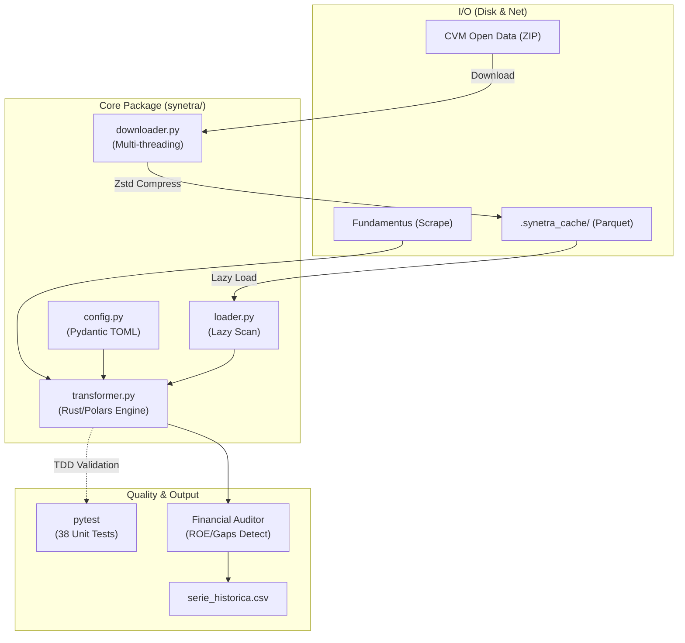

# 📖 Synetra Technical Wiki (v1.0.0)

> Documentação técnica completa do pipeline de inteligência financeira Synetra. Foco em arquitetura orientada a performance (Rust/Polars) e auditoria de dados (TDD).

---

## Sumário

1. [Guia para Engenheiros Principais (Principal-Level Guide)](#-guia-para-engenheiros-principais)
2. [Zero-to-Hero: Guia de Onboarding](#-zero-to-hero-guia-de-onboarding)
3. [Arquitetura do Sistema](#-arquitetura-do-sistema)
4. [Referência de Módulos (Deep Dive)](#-referência-de-módulos)
5. [Guia de Configuração (parameters.toml)](#-guia-de-configuração)
6. [Sistema de Cache](#-sistema-de-cache)
7. [Glossário e Fórmulas](#-glossário)

---

## 🎯 Guia para Engenheiros Principais

### O Insight Arquitetural Central

O Synetra é um pipeline ETL financeiro onde **toda a lógica de negócio é declarativa** (vive em `parameters.toml`), protegida por **tipagem estrita** (Pydantic), e **todo o processamento matemático é vetorizado** via Polars (Single-Evaluation Engine). O código Python atua puramente como "cola" de orquestração.

Em pseudocódigo (TypeScript-style para contraste):

```typescript
// O núcleo arquitetural do Synetra v1.0.0
const config = TOML.parse<PydanticSchema>("parameters.toml"); 
const rawBytes = await parallelDownload(config.urls); 

// Pipeline Lazily Evaluated no motor Rust (Zero-Copy)
const dataframe = lazyScan(rawBytes)
    .applyGlobalJoin(config.contas)
    .applyPiotroskiWindows()
    .collect(); 

auditDataQuality(dataframe); // Post-processing TDD checks
```

### Tradeoffs de Design (v1.0.0)

| Decisão | Escolha | Alternativa Rejeitada | Razão (A Defesa) |
|---------|---------|----------------------|-------|
| **Engine Core** | Polars (Rust) | Pandas (Python) | 10-50x mais rápido. Evita o GIL do Python e otimiza alocação de RAM via Lazy API. |
| **Relacionamentos** | Single-Join Global | Múltiplos Joins isolados | Reduz a complexidade de Tempo de O(3N) para O(N) no `map_accounts`. |
| **Injeção de Nulos** | Single-Evaluation List | Loop `for` dinâmico | Permite que o Query Optimizer do Polars aloque memória em paralelo para 30+ colunas. |
| **Data Quality** | Logs de Auditoria (Keep) | Drop Outliers | O dado da CVM é a "Verdade". Um ROE de 1115% é anomalia contábil real, não deve ser apagada, mas sinalizada. |
| **Testes** | TDD Unitário (38 testes) | E2E Tests puros | Matemática financeira é implacável. Testamos divisões por zero e F-Score bit a bit isoladamente. |

### Ordem de Leitura Recomendada ("Where to go deep")
1. `parameters.toml` — O coração do domínio financeiro.
2. `synetra/transformer.py` — Estudar a refatoração de Joins e Comprehensions (Polars Avançado).
3. `tests/test_transformer.py` — A rede de segurança da engenharia.
4. `synetra/loader.py` — Deduplicação (CON > IND, DFC_MI > DFC_MD).

---

## 🚀 Zero-to-Hero: Guia de Onboarding

### Parte I: Fundamentos Tecnológicos

#### Python + Polars (A Diferença)
No Synetra, evitamos escrever loops em Python. Usamos **expressões** (`pl.Expr`) que rodam em C++/Rust:

```python
# MÁ PRÁTICA (Estilo Pandas/Python):
df['NOVA_COLUNA'] = df.apply(lambda row: row['A'] / row['B'])

# ESTILO SYNETRA (Estilo Polars/Rust):
df = df.with_columns((pl.col('A') / pl.col('B')).alias('NOVA_COLUNA'))
```

#### TDD (Test-Driven Development)
Nenhum indicador financeiro é adicionado sem um teste correspondente. A suíte de 38 testes usa dicionários injetados no Polars para simular cenários absurdos (Patrimônio Líquido R$ 0.01, Receita Zerada) e provar a robustez do cálculo.

### Parte II: O Modelo de Domínio

O Pipeline processa os arquivos da CVM obedecendo a essa taxonomia:
*   **DFP:** Demonstrações anuais oficiais.
*   **FRE:** Formulário com a quantidade de ações (para calcular LPA/VPA).
*   **DOC_TYPES:** 
    *   `BPA` (Ativo), `BPP` (Passivo/PL).
    *   `DRE` (Receitas/Despesas).
    *   `DFC_MI` / `DFC_MD` (Fluxo de Caixa).

### Parte III: Setup de Desenvolvimento

```bash
# 1. Clonar e criar ambiente
git clone https://github.com/leoserpa/synetra.git
cd synetra
python -m venv venv
venv\Scripts\activate # (Windows)

# 2. Instalar dependências (incluindo Pytest para TDD)
pip install -r requirements.txt

# 3. Rodar a suíte de Testes (OBRIGATÓRIO antes de commits)
pytest tests/ -v

# 4. Rodar o pipeline principal
python main.py
```

---

## 🏗 Arquitetura do Sistema

### Diagrama de Arquitetura



---

## 📚 Referência de Módulos

### `transformer.py` (O Motor)
**Arquivo:** `c:\Projeto_CVM\synetra\transformer.py`

Esta é a "Jóia da Coroa" da engenharia do Synetra.
*   **`map_accounts(df, config)`:** Mapeia milhões de registros (`CD_CONTA`) contra o TOML usando um "Single-Join Global". O que antes eram 3 joins isolados agora é O(N).
*   **`calculate_indicators(df_history, ...)`:** Pivot dinâmico. Injeção de mais de 15 colunas matemáticas base com *Single-Evaluation* `df.with_columns([ ... ])` impedindo realocações de memória RAM.
*   **Piotroski F-Score:** Calculado usando Window Functions idiomáticas (`pl.col('X').shift(1).over('TICKER')`), sem iterações ou loops Python.

### `loader.py` (O Sanitizador)
**Regras de Deduplicação (Críticas):**
1. **CON > IND:** Consolidadas têm prioridade absoluta sobre Individuais.
2. **DFC_MI > DFC_MD:** Fluxo Indireto prevalece (por ser padrão de mercado).
3. **Escala CVM:** Múltiplos arquivos vêm listados como "MIL". O Loader multiplica por `1.000` em tempo de ingestão.

---

## ⚙ Guia de Configuração

O arquivo `parameters.toml` controla **tudo**. Ele é validado no boot pelo Pydantic. Se você errar a sintaxe, o sistema morre graciosamente antes de baixar 1 byte.

```toml
[contas.industrial]
"3.01" = "RECEITA_LIQUIDA"  # CD_CONTA CVM -> Variável Financeira

[contas.financeiro]
"3.01.01" = "RECEITA_INTERMEDIACAO"
"2.08" = "PATRIMONIO_LIQUIDO" # Bancos usam conta 2.08, não 2.03
```

---

## 📝 Glossário e Fórmulas Matemáticas Implementadas

| Indicador | Fórmula Synetra (Polars Expr) | Significado |
|-----------|-------------------------------|-------------|
| **ROE** | `LUCRO_LIQUIDO / PATRIMONIO_LIQUIDO` | Retorno sobre o Patrimônio. |
| **ROA** | `LUCRO_LIQUIDO / ATIVO_TOTAL` | Retorno sobre os Ativos. |
| **ROIC** | `(EBIT * 0.66) / (PL + DIVIDA_TOTAL)` | Retorno sobre o Capital Investido (assumindo IR de 34%). |
| **Margens** | `Conta / RECEITA_LIQUIDA` | Margens (Bruta, EBIT, Liquida). |
| **EBITDA** | `EBIT + DEPREC_AMORT` | Geração de caixa operacional proxy. |
| **FCL** | `FCO + CAPEX` | Fluxo de Caixa Livre (Dinheiro que sobra pro acionista/dívida). |
| **Dívida Líquida**| `DIVIDA_BRUTA - CAIXA` | Endividamento real descontando liquidez imediata. |
| **LPA / VPA** | `(Lucro ou PL) / QTDE_ACOES` | Valores pulverizados por ação (essencial para P/L). |
| **F-Score** | `[Soma de 9 Condições Binárias]` | Piotroski: 9 pontos avaliando Lucratividade, Alavancagem e Eficiência. |

---

*Documentação arquitetada para a versão 1.0.0 de Alta Performance. Atualize com responsabilidade técnica.*
