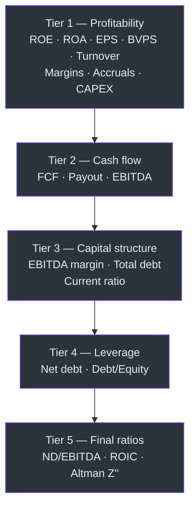

# Synetra Technical Wiki

[Leia em Português](WIKI.md) · [Read in English](WIKI_EN.md)

Technical reference for the Synetra ETL pipeline: how raw CVM values become fundamental indicators, where each account is pulled from, and which rules separate industrial companies, banks and insurers.

This document is derived from the actual code. Every formula cites the file and function where it lives.

---

## Table of contents

1. [Contracts and conventions](#contracts-and-conventions)
2. [From CVM to indicator — overview](#from-cvm-to-indicator--overview)
3. [Account mapping per sector](#account-mapping-per-sector)
4. [Sector classification](#sector-classification)
5. [Special account detection (regex)](#special-account-detection-regex)
6. [Pivot and consolidation](#pivot-and-consolidation)
7. [Net income resolution](#net-income-resolution)
8. [Indicators per tier (domain layer)](#indicators-per-tier-domain-layer)
9. [Piotroski F-Score](#piotroski-f-score)
10. [Beneish M-Score](#beneish-m-score)
11. [Growth — YoY and CAGR](#growth--yoy-and-cagr)
12. [Quantitative factors (Quality · Momentum · Risk)](#quantitative-factors-quality--momentum--risk)
13. [Operational efficiency and quality](#operational-efficiency-and-quality)
14. [Valuation — historical and current snapshot](#valuation--historical-and-current-snapshot)
15. [Sector-aware cleanup — consolidated summary](#sector-aware-cleanup--consolidated-summary)
16. [Auditing and Data Quality](#auditing-and-data-quality)
17. [Rounding and output types](#rounding-and-output-types)
18. [File cross-reference](#file-cross-reference)

---

## Contracts and conventions

The invariants that keep the pipeline predictable.

| Convention | Rule | Why |
|---|---|---|
| Pure domain | Everything under `synetra/domain/` uses only Polars expressions. No I/O, no config. | Each formula can be tested in isolation. |
| Immutable config | `SynetraConfig` is `frozen=True`. Validated before any I/O. | A broken config aborts early, not mid-pipeline. |
| Monetary values | CVM CSV's `MIL` scale is multiplied by 1000 to become unit (R$). | `synetra/loader.py → _apply_monetary_scale`. |
| Safe division | Zero or null denominator returns `None`, never `inf` or `NaN`. | `synetra/domain/indicators.py → safe_div`. |
| Output types | Ratios with 4 decimals, monetary values with 2, Market Cap with none. | `synetra/transformer.py → _COLS_ROUND_4D/_COLS_ROUND_2D`. |
| Sector-aware cleanup | Metrics that don't apply to a sector return `null`, not zero. | Prevents rankings from mixing companies on metrics that don't mean the same thing. |

### Notation

- LaTeX expressions ($`\cdot`$) for math.
- ```python``` blocks when showing the Polars expression is essential.
- `null` means `None` (Polars) — explicitly absent, different from zero.
- "Category" refers to the `Categoria` enum (`INDUSTRIAL`, `FINANCEIRO`, `SEGURADORA`).

---

## From CVM to indicator — overview

The pipeline runs four passes over the CVM data before producing the historical series. Each pass adds information without rewriting what came before.

```mermaid
graph LR
    subgraph CVM["Raw CVM data"]
        ZIP["Yearly ZIPs<br>DFP + FRE + Registry"]
    end

    subgraph P1["1. Preparation"]
        PROJ["Projection pushdown<br>(5 core columns)"]
        SETOR["Sector enrichment<br>+ 3-category classification"]
        REGEX["Special account<br>detection (regex)"]
        MAP["Code → name map<br>(per sector)"]
    end

    subgraph P2["2. Pivot"]
        PIVOT["pivot VL_CONTA<br>by CONTA_NOME"]
        FILL["Fill missing<br>columns with 0.0"]
        SEGUROS["Insurer cash<br>consolidation"]
        LUCRO["Net income<br>resolution"]
        FRE["FRE merge<br>(share count)"]
    end

    subgraph P3["3. Calculations"]
        TIER["Tiers 1 to 5<br>(domain layer)"]
        SHIFT["Shifts and rolling<br>in a single batch"]
        FBEN["F-Score and<br>Beneish"]
        QUANT["Growth + Quant<br>+ Efficiency"]
    end

    subgraph P4["4. Finalization"]
        CLEAN["Drop auxiliaries"]
        ROUND["Rounding"]
        RENAME["LUCRO_FINAL → LUCRO_LIQUIDO"]
    end

    CVM --> P1 --> P2 --> P3 --> P4

    style CVM fill:#161b22,stroke:#30363d,color:#e6edf3
    style P1 fill:#161b22,stroke:#30363d,color:#e6edf3
    style P2 fill:#161b22,stroke:#30363d,color:#e6edf3
    style P3 fill:#161b22,stroke:#30363d,color:#e6edf3
    style P4 fill:#161b22,stroke:#30363d,color:#e6edf3
```



The 11 steps of `FinancialTransformer.calculate_indicators` (in `synetra/transformer.py`):

| # | Step | Responsibility |
|---|---|---|
| 1 | `_prepare_history` | Projection pushdown + sectors + regex + account map |
| 2 | `_pivot_and_consolidate` | Pivot, fill, cash consolidation, net income resolution, FRE merge |
| 3 | `calculate_all_indicators` | Tiers 1 to 5 (domain layer) |
| 4 | `_merge_tickers` | Join with `mapa_tickers.csv` + column selection |
| 5 | `_apply_sector_assepsia` | Null out industrial metrics for banks/insurers |
| 6 | `_prepare_shifts` | Generate `_prev`, `_BASE`, rolling stats in a single `with_columns` |
| 7 | `_calculate_fscore` | Piotroski F-Score (9 criteria, industrial only) |
| 8 | `_calculate_beneish` | Beneish M-Score (8 terms, industrial only) |
| 9 | `_calculate_growth_and_quant` | YoY, CAGR, 5 quantitative factors |
| 10 | `_calculate_efficiency_and_quality` | 10 efficiency indicators |
| 11 | `_round_and_finalize` | Drop auxiliaries + rounding + public rename |

---

## Account mapping per sector

CVM account codes (`CD_CONTA`) have different meanings depending on the sector. A bank uses `3.09` for net income; an industrial company uses `3.11`. Synetra keeps three independent maps in `config.toml` and applies the correct one after sector classification.

The lookup happens in a single global join at `synetra/transformer.py → map_accounts`: all maps become one `(CATEGORIA, CD_CONTA) → CONTA_NOME` DataFrame, and a single `join` resolves everything. No Python loops.

### Industrial — `config.toml [contas.industrial]`

| CVM code | Internal name | What it represents |
|---|---|---|
| `1` | `ATIVO_TOTAL` | Total assets (current + non-current) |
| `1.01` | `ATIVO_CIRCULANTE` | Short-term assets (cash, receivables, inventory) |
| `1.01.01` and `1.01.02` | `CAIXA_EQUIVALENTES` | Cash and equivalents (two lines aggregated via `sum`) |
| `1.01.03` | `CONTAS_A_RECEBER` | Trade receivables |
| `1.02` | `ATIVO_NAO_CIRCULANTE` | Long-term assets |
| `1.02.03` | `IMOBILIZADO` | PP&E (Property, Plant & Equipment) |
| `2.01` | `PASSIVO_CIRCULANTE` | Short-term liabilities |
| `2.01.04` | `DIVIDA_CP` | Short-term loans and financing |
| `2.02.01` | `DIVIDA_LP` | Long-term loans and financing |
| `2.03` | `PATRIMONIO_LIQUIDO` | Parent company equity |
| `3.01` | `RECEITA_LIQUIDA` | Net operating revenue |
| `3.03` | `RESULTADO_BRUTO` → `LUCRO_BRUTO` | Revenue − COGS |
| `3.04` | `DESPESAS_OPERACIONAIS` | SG&A (selling, general and administrative) |
| `3.05` | `EBIT` | Operating result |
| `3.09` | `LUCRO_LIQUIDO_BCO` | Fallback (for industrials using the bank layout) |
| `3.09.01` | `LUCRO_CONTROLADORA_BCO` | Parent company fallback |
| `3.11` | `LUCRO_LIQUIDO` | Consolidated net income |
| `3.11.01` | `LUCRO_CONTROLADORA` | Parent company net income (preferred source) |
| `6.01` | `FCO` | Cash flow from operations |
| `6.02` | `FCI` | Cash flow from investing |
| `6.03` | `FCF` | Cash flow from financing |

### Financial (banks) — `config.toml [contas.financeiro]`

Banks don't have `ATIVO_CIRCULANTE`/`PASSIVO_CIRCULANTE` in the industrial sense. The bank layout in CVM exposes equity under different codes.

| CVM code | Internal name | Note |
|---|---|---|
| `1` | `ATIVO_TOTAL` | |
| `1.01.01` | `CAIXA_EQUIVALENTES` | |
| `1.01.08` | `CONTAS_A_RECEBER` | Credit operations to clients |
| `1.06` | `IMOBILIZADO` | |
| `2.01` | `PASSIVO_CIRCULANTE` | Short-term payables |
| `2.07` and `2.08` | `PATRIMONIO_LIQUIDO` | Two aggregated accounts — banking group equity |
| `3.01` | `RECEITA_LIQUIDA` | Financial intermediation revenue |
| `3.03` | `RESULTADO_BRUTO` → `LUCRO_BRUTO` | |
| `3.04` | `DESPESAS_OPERACIONAIS` | |
| `3.05` | `EBIT` | |
| `3.09` | `LUCRO_LIQUIDO` | **Bank layout**: primary account |
| `3.09.01` | `LUCRO_CONTROLADORA` | Preferred source for bank EPS |
| `3.11` and `3.11.01` | `LUCRO_LIQUIDO_BCO` / `LUCRO_CONTROLADORA_BCO` | Fallbacks |
| `6.01`, `6.02`, `6.03` | `FCO`, `FCI`, `FCF` | |

### Insurance — `config.toml [contas.seguradora]`

Insurers hold large financial investments. Synetra consolidates cash + short-term + long-term investments into a single `CAIXA_EQUIVALENTES` to reflect real liquidity.

| CVM code | Internal name |
|---|---|
| `1` | `ATIVO_TOTAL` |
| `1.01` | `ATIVO_CIRCULANTE` |
| `1.01.01` | `CAIXA_EQUIVALENTES` |
| `1.01.02` | `APLICACOES_CP` (added to cash post-pivot) |
| `1.01.03` | `CONTAS_A_RECEBER` |
| `1.02` | `ATIVO_NAO_CIRCULANTE` |
| `1.02.01.01` | `APLICACOES_LP` (added to cash post-pivot) |
| `1.02.03` | `IMOBILIZADO` |
| `2.01` | `PASSIVO_CIRCULANTE` |
| `2.03` | `PATRIMONIO_LIQUIDO` |
| `3.01` and `3.01.01` | `RECEITA_LIQUIDA` |
| `3.03` | `RESULTADO_BRUTO` → `LUCRO_BRUTO` |
| `3.04` | `DESPESAS_OPERACIONAIS` |
| `3.09`, `3.09.01` | `LUCRO_LIQUIDO_BCO`, `LUCRO_CONTROLADORA_BCO` |
| `3.11`, `3.11.01` | `LUCRO_LIQUIDO`, `LUCRO_CONTROLADORA` |
| `6.01`, `6.02`, `6.03` | `FCO`, `FCI`, `FCF` |

---

## Sector classification

A company's category is decided by keywords in the `SETOR_ATIV` field from the CVM registry.

File: `synetra/transformer.py → classify_sectors`.

```python
if SETOR_ATIV matches any keyword in [setores.financeiro]:
    CATEGORIA = FINANCEIRO
elif SETOR_ATIV matches any keyword in [setores.seguradora]:
    CATEGORIA = SEGURADORA
else:
    CATEGORIA = INDUSTRIAL
```

Active keywords in `config.toml`:

| Category | Keywords |
|---|---|
| Financial | `BANCO`, `ARRENDAMENTO`, `FACTORING`, `CREDITO`, `SECURITIZACAO` |
| Insurance | `SEGURO`, `SEGURADORA`, `PREVIDENCIA`, `CAPITALIZACAO` |
| Industrial | (fallback — any company that doesn't match the rules above) |

Comparison is case-insensitive (regex prefix `(?i)` is prepended at runtime) and uses `str.contains`, so "BANCO DO BRASIL" and "BCO DO BRASIL" both match.

---

## Special account detection (regex)

Three account types don't follow a fixed code. The name varies per company. CVM allows free-text descriptions (`DS_CONTA`) inside the cash flow statement. Synetra normalizes the text (uppercase without accents) and runs regex to extract:

File: `synetra/transformer.py → detect_special_accounts`.
Regex patterns in `config.toml [regex]`.

| Virtual account | CVM prefix | Regex on description | Exclusions |
|---|---|---|---|
| `DEPREC_AMORT` | `6.01` (FCO) | `DEPRECIA\|AMORTIZA` | must not contain `AJUSTE` or `JUROS` |
| `CAPEX_VAL` | `6.02` (FCI) | `AQUISIC\|ADIC\|COMPRA` **AND** `IMOBILIZADO\|INTANGIVEL` | — |
| `DIVIDENDOS_PAGOS` | `6.03` (FCF) | `DIVIDENDO\|JURO SOBRE CAPITAL\|JUROS SOBRE CAPITAL\|JURO S CAPITAL\|JUROS S CAPITAL\|JCP` | — |
| `EBIT` (insurer) | any | `RESULTADO ANTES DO RESULTADO FINANCEIRO\|RESULTADO ANTES DAS RECEITAS` | only when `CATEGORIA = SEGURADORA` |

Text normalization happens in `synetra/utils.py → clean_text_expr`: removes accents (ÁÀÂÃÄ → A, etc), uppercases and strips, all via native Polars expressions.

---

## Pivot and consolidation

After mapping codes to names, the DataFrame is still in long format (one row per account). The pivot transforms it into wide format (one column per account).

File: `synetra/transformer.py → _pivot_and_consolidate`.

### Memory optimization

Before the pivot, low-cardinality columns are cast to `Categorical`: `CNPJ_CIA`, `CATEGORIA`, `SETOR_ATIV`, `CONTA_NOME`. On a dataset with ~380 tickers × 16 years this cuts memory footprint by roughly 70%.

### Pivot

```python
pivot(
    values="VL_CONTA",
    index=["CNPJ_CIA", "ANO", "CATEGORIA", "SETOR_ATIV"],
    on="CONTA_NOME",
    aggregate_function="sum",
)
```

The `sum` aggregation is needed because some accounts appear on multiple CSV rows (e.g. `1.01.01` and `1.01.02` both map to `CAIXA_EQUIVALENTES` in the industrial layout).

### Filling missing columns

After the pivot, `_ensure_all_account_columns` guarantees every expected column exists. If a sector never had a specific account in a given year, the column is created with `0.0`. That prevents `KeyError` downstream.

### Insurer cash consolidation

$$
\text{CAIXA EQUIVALENTES}_{\text{insurer}} = \text{Cash} + \text{ST investments} + \text{LT investments}
$$

For other sectors, `CAIXA_EQUIVALENTES` is left alone.

Rationale: insurers keep technical reserves in liquid financial investments. Ignoring that understates real liquidity by orders of magnitude.

---

## Net income resolution

The `LUCRO_FINAL` field (renamed to `LUCRO_LIQUIDO` at output) follows a 4-level hierarchy. The preference is to use **parent company earnings** (excluding non-controlling interests) to align EPS and P/E with what analysts and data providers report.

File: `synetra/transformer.py → _resolve_net_income`.

```python
LUCRO_FINAL =
    LUCRO_CONTROLADORA         if != 0   (account 3.11.01, industrial)
    else LUCRO_CONTROLADORA_BCO if != 0  (account 3.09.01, bank)
    else LUCRO_LIQUIDO         if != 0   (account 3.11, industrial consolidated)
    else LUCRO_LIQUIDO_BCO               (account 3.09, bank consolidated)
```

| Level | Field | CVM source | When used |
|---|---|---|---|
| 1 | `LUCRO_CONTROLADORA` | `3.11.01` | Top preference when present and non-zero |
| 2 | `LUCRO_CONTROLADORA_BCO` | `3.09.01` | Industrials using the bank layout |
| 3 | `LUCRO_LIQUIDO` | `3.11` | Consolidated total (when parent is not reported separately) |
| 4 | `LUCRO_LIQUIDO_BCO` | `3.09` | Final fallback |

---

## Indicators per tier (domain layer)

All indicators below live in `synetra/domain/indicators.py` as pure functions. They run in five tiers with chained dependencies. A tier can only use columns produced by earlier tiers.



### Tier 1 — Profitability and bases

Function: `get_tier1_expressions()`.

| Indicator | Formula | Sectors | Accounts used |
|---|---|---|---|
| `ROE` | $`\dfrac{\text{Net Income}}{\text{Equity}}`$ | All | `LUCRO_FINAL`, `PATRIMONIO_LIQUIDO` |
| `ROA` | $`\dfrac{\text{Net Income}}{\text{Total Assets}}`$ | All | `LUCRO_FINAL`, `ATIVO_TOTAL` |
| `LPA` (EPS) | $`\dfrac{\text{Net Income}}{\text{Shares Out.}}`$ | All | `LUCRO_FINAL`, `QTDE_ACOES` (FRE) |
| `VPA` (BVPS) | $`\dfrac{\text{Equity}}{\text{Shares Out.}}`$ | All | `PATRIMONIO_LIQUIDO`, `QTDE_ACOES` |
| `GIRO_ATIVO` (Turnover) | $`\dfrac{\text{Net Revenue}}{\text{Total Assets}}`$ | All | `RECEITA_LIQUIDA`, `ATIVO_TOTAL` |
| `ALAVANCAGEM_LP` | $`\dfrac{\text{LT Debt}}{\text{Total Assets}}`$ | All | `DIVIDA_LP`, `ATIVO_TOTAL` (auxiliary; dropped at finalize) |
| `ACCRUALS` | $`\text{Net Income} - \text{FCO}`$ | All | `LUCRO_FINAL`, `FCO` |
| `ACCRUAL_RATIO` | $`\dfrac{\text{Net Income} - \text{FCO}}{\text{Total Assets}}`$ | Industrial | `LUCRO_FINAL`, `FCO`, `ATIVO_TOTAL` |
| `GP_A` | $`\dfrac{\text{Gross Profit}}{\text{Total Assets}}`$ | Industrial | `RESULTADO_BRUTO`, `ATIVO_TOTAL` |
| `MARGEM_EBIT` | $`\dfrac{\text{EBIT}}{\text{Net Revenue}}`$ | All (nulled for banks) | `EBIT`, `RECEITA_LIQUIDA` |
| `MARGEM_LIQUIDA` | $`\dfrac{\text{Net Income}}{\text{Net Revenue}}`$ | All | `LUCRO_FINAL`, `RECEITA_LIQUIDA` |
| `MARGEM_BRUTA` | $`\dfrac{\text{Gross Profit}}{\text{Net Revenue}}`$ | All (nulled for banks/insurers) | `RESULTADO_BRUTO`, `RECEITA_LIQUIDA` |
| `CAPEX` | `CAPEX_VAL` (via regex) | Industrial + Insurance | detected by regex in `detect_special_accounts` |
| `DEPREC_AMORT` | `DEPREC_AMORT` (via regex) | Industrial + Insurance | same |
| `PROVENTOS` (Dividends paid) | $`\lvert\text{Dividends Paid}\rvert`$ | All | `DIVIDENDOS_PAGOS` (regex) |

### Tier 2 — Cash flow

Function: `get_tier2_expressions()`.

**FCL — Free Cash Flow**

Different logic per category. CAPEX is already negative on the statement, so addition is mathematically equivalent to subtraction.

$$
\text{FCF} = \begin{cases}
\text{FCO} + \text{FCI} & \text{if CATEGORIA} = \text{FINANCEIRO} \\
\text{FCO} + \text{CAPEX} & \text{otherwise}
\end{cases}
$$

Banks don't have "physical" CAPEX. The entire investing flow (interbank placements, securities) is part of the core business.

**Payout**

$$
\text{PAYOUT} = \dfrac{\text{Dividends}}{\text{Net Income}}
$$

Zero or negative denominator → `null` (via `safe_div`).

**EBITDA**

$$
\text{EBITDA} = \text{EBIT} + |\text{Depreciation and Amortization}|
$$

The `fill_null(0)` avoids losing EBITDA when the company doesn't disclose D&A separately.

### Tier 3 — Capital structure

Function: `get_tier3_expressions()`.

| Indicator | Formula | Sectors | Note |
|---|---|---|---|
| `MARGEM_EBITDA` | $`\dfrac{\text{EBITDA}}{\text{Net Revenue}}`$ | All (nulled for banks) | — |
| `DIVIDA_TOTAL` | $`\text{ST Debt} + \text{LT Debt}`$ (industrial) $`\mid`$ $`0`$ (insurer) $`\mid`$ `null` (bank) | varies | Banks treat "debt" as raw material, not operational financing |
| `LIQUIDEZ_CORRENTE` (Current ratio) | $`\dfrac{\text{Current Assets}}{\text{Current Liabilities}}`$ | Industrial | `null` for banks and insurers |

Renamed at `_merge_tickers`: `DIVIDA_TOTAL` becomes `DIVIDA_BRUTA` (gross debt) in the public output.

### Tier 4 — Leverage

Function: `get_tier4_expressions()`.

| Indicator | Formula | Sectors |
|---|---|---|
| `DIVIDA_LIQUIDA` (Net Debt) | $`\text{Total Debt} - \text{Cash and Equivalents}`$ | Industrial |
| | $`0 - \text{Cash}`$ | Insurer |
| | `null` | Bank |
| `DIVIDA_PL` (Debt/Equity) | $`\dfrac{\text{Total Debt}}{\text{Equity}}`$ | Industrial |
| | $`0`$ | Insurer |
| | `null` | Bank |

### Tier 5 — Final ratios

Function: `get_tier5_expressions()`.

**ND/EBITDA**

$$
\text{ND/EBITDA} = \dfrac{\text{Net Debt}}{\text{EBITDA}}
$$

Applicable to industrials and insurers. `null` for banks.

**ROIC — Return on Invested Capital (Damodaran)**

$$
\text{ROIC} = \dfrac{\text{EBIT} \times (1 - t)}{\text{Equity} + \text{Gross Debt}}
$$

Where $`t = 0.34`$ is the combined Brazilian corporate tax rate (IR + CSLL, per Laws 9.249/95 and 9.316/96), defined as `BRAZIL_TAX_RATE`. Industrial only.

**Altman Z''-Score for Emerging Markets**

$$
Z'' = 6.56 \cdot A + 3.26 \cdot B + 6.72 \cdot C + 1.05 \cdot D
$$

Where:

$$
\begin{aligned}
A &= \dfrac{\text{Current Assets} - \text{Current Liab.}}{\text{Total Assets}} \\
B &= \dfrac{\text{Equity}}{\text{Total Assets}} \\
C &= \dfrac{\text{EBIT}}{\text{Total Assets}} \\
D &= \dfrac{\text{Equity}}{\text{Total Liabilities}}
\end{aligned}
$$

Total liabilities is computed as $`\text{Total Assets} - \text{Equity}`$. Coefficients hardcoded as `ALTMAN_COEF_WC_TA`, `ALTMAN_COEF_RE_TA`, `ALTMAN_COEF_EBIT_TA`, `ALTMAN_COEF_BV_TL`. Industrial only.

Reference: Altman (2005), *"An Emerging Market Credit Scoring System for Corporate Bonds"*.

| Zone | Interpretation |
|---|---|
| $`Z'' > 2.60`$ | Safe — low distress risk |
| $`1.10 < Z'' \leq 2.60`$ | Grey — monitor |
| $`Z'' \leq 1.10`$ | Distress — high bankruptcy probability in 2 years |

---

## Piotroski F-Score

0-to-9 score measuring earnings quality. Each binary criterion (pass/fail) adds 1 point. Industrial only — the criteria assume operational accounting.

File: `synetra/transformer.py → _calculate_fscore`.

| # | Category | Criterion | Expression |
|---|---|---|---|
| 1 | Profitability | Positive ROA | $`\text{ROA} > 0`$ |
| 2 | Profitability | Positive CFO | $`\text{FCO} > 0`$ |
| 3 | Profitability | Growing ROA | $`\text{ROA}_t > \text{ROA}_{t-1}`$ |
| 4 | Earnings quality | CFO greater than net income | $`\text{FCO} > \text{Net Income}`$ |
| 5 | Leverage | LT leverage dropping | $`\text{ALAVANCAGEM\_LP}_t < \text{ALAVANCAGEM\_LP}_{t-1}`$ |
| 6 | Liquidity | Current ratio growing | $`\text{CURR}_t > \text{CURR}_{t-1}`$ |
| 7 | Dilution | No share issuance | $`\text{SHARES}_t \leq \text{SHARES}_{t-1}`$ |
| 8 | Efficiency | Gross margin growing | $`\text{GM}_t > \text{GM}_{t-1}`$ |
| 9 | Efficiency | Asset turnover growing | $`\text{TURN}_t > \text{TURN}_{t-1}`$ |

**Guards:**

- `F_SCORE = null` when `ROA_prev` is null (no history).
- `F_SCORE = null` for `FINANCEIRO` and `SEGURADORA`.
- A criterion with null operand contributes 0 (fail-closed).

**Typical reading:** $`F = 8`$ or $`9`$ means high quality; $`F \leq 2`$ means deteriorating. Piotroski (2000) showed that a long-short built on high F minus low F generates meaningful alpha on value stock samples.

---

## Beneish M-Score

Earnings manipulation detector. Eight terms comparing current vs. prior year to capture revenue inflation, asset stretching, and aggressive accruals.

File: `synetra/transformer.py → _calculate_beneish` and `_beneish_*` helpers.

$$
M = -4.84 + 0.920 \cdot \text{DSRI} + 0.528 \cdot \text{GMI} + 0.404 \cdot \text{AQI} + 0.892 \cdot \text{SGI}
$$
$$
{}+ 0.115 \cdot \text{DEPI} - 0.172 \cdot \text{SGAI} + 4.679 \cdot \text{TATA} - 0.327 \cdot \text{LVGI}
$$

Reference: Beneish, M. D. (1999), *"The Detection of Earnings Manipulation"*, Financial Analysts Journal.

### The 8 terms

| Term | Name | Formula | What it catches |
|---|---|---|---|
| DSRI | Days Sales in Receivables Index | $`\dfrac{\text{AR}_t / \text{Rev}_t}{\text{AR}_{t-1} / \text{Rev}_{t-1}}`$ | Revenue inflation via aggressive credit |
| GMI | Gross Margin Index | $`\dfrac{\text{GM}_{t-1}}{\text{GM}_t}`$ | Margin deterioration (incentive to manipulate) |
| AQI | Asset Quality Index | $`\dfrac{1 - \frac{CA_t + \text{PPE}_t}{TA_t}}{1 - \frac{CA_{t-1} + \text{PPE}_{t-1}}{TA_{t-1}}}`$ | Improper capitalization into non-current assets |
| SGI | Sales Growth Index | $`\dfrac{\text{Rev}_t}{\text{Rev}_{t-1}}`$ | Explosive growth (pressure to keep it going) |
| DEPI | Depreciation Index | $`\dfrac{D_{t-1} / (D_{t-1} + \text{PPE}_{t-1})}{D_t / (D_t + \text{PPE}_t)}`$ | Slowing depreciation to inflate earnings |
| SGAI | SG&A Expenses Index | $`\dfrac{\text{Opex}_t / \text{Rev}_t}{\text{Opex}_{t-1} / \text{Rev}_{t-1}}`$ | Disconnect between expenses and revenue |
| TATA | Total Accruals to Total Assets | $`\dfrac{\text{Accruals}_t}{\text{Total Assets}_t}`$ | Accounting income detached from cash |
| LVGI | Leverage Index | $`\dfrac{\text{Debt}_t / TA_t}{\text{Debt}_{t-1} / TA_{t-1}}`$ | Rising leverage pressuring accounting |

### Guards

- `BENEISH_M = null` when history is missing (`RECEITA_LIQUIDA_prev` or `ATIVO_TOTAL_prev` null).
- `BENEISH_M = null` for financial and insurance sectors.
- Intermediate terms use `safe_div` — any zero denominator propagates `null`.

### Interpretation

$`M > -2.22`$ flags the company as a manipulation candidate. Not proof. A signal to dig deeper into the financials.

---

## Growth — YoY and CAGR

File: `synetra/transformer.py → _yoy_growth_expressions`, `_cagr_expressions`.

### YoY (Year-over-Year)

$$
\text{YoY} = \dfrac{\text{Value}_t}{\text{Value}_{t-1}} - 1 \qquad \text{(only if base} > 0\text{)}
$$

| Indicator | Base |
|---|---|
| `CRESC_RECEITA_YOY` | Prior year `RECEITA_LIQUIDA` |
| `CRESC_LUCRO_YOY` | Prior year `LUCRO_FINAL` |

Base $`\leq 0`$ returns `null`. This avoids misleading "growth" when a company is coming out of losses.

### CAGR (Compound Annual Growth Rate)

$$
\text{CAGR}(N) = \left(\dfrac{\text{Value}_t}{\text{Value}_{t-N}}\right)^{1/N} - 1
$$

| Indicator | $`N`$ | Base |
|---|---|---|
| `CAGR_RECEITA_3A` | 3 | `RECEITA_LIQUIDA` 3 years ago |
| `CAGR_RECEITA_5A` | 5 | `RECEITA_LIQUIDA` 5 years ago |
| `CAGR_LUCRO_3A` | 3 | `LUCRO_FINAL` 3 years ago |
| `CAGR_LUCRO_5A` | 5 | `LUCRO_FINAL` 5 years ago |

**Math guards:**

| Case | Behavior |
|---|---|
| Base $`\leq 0`$ | `null` — root of a non-positive is invalid |
| Current value $`\leq 0`$ | `null` — current losses on a positive base distort the reading |
| Insufficient history (less than $`N+1`$ years) | `null` — no comparison base |
| Cross-ticker contamination | prevented by `shift(N).over("TICKER")` |

**Cross-read matrix:**

| 5Y CAGR | 3Y CAGR | Diagnosis |
|---|---|---|
| High | High | Consistent growth |
| Low | High | Recent turnaround |
| High | Low | Deceleration |
| Low | Low | Stagnation or decline |

All CAGRs are sector-agnostic.

---

## Quantitative factors (Quality · Momentum · Risk)

Five factors used in quantitative finance (AQR, Dimensional, Fama-French) derived from columns already available.

File: `synetra/transformer.py → _quant_factor_expressions`.

### Factor table

| Factor | Category | Formula | Sectors |
|---|---|---|---|
| `CASH_CONVERSION` | Quality | $`\dfrac{\text{FCO}}{\text{Net Income}}`$ (only if profit $`> 0`$) | Industrial + Insurance |
| `EARNINGS_STABILITY` | Quality / Risk | $`\text{std}(\text{ROE})`$ over 5 years | All |
| `VOL_LUCRO` | Risk | $`\dfrac{\text{std}(\text{Income})_{5y}}{\text{mean}(\text{Income})_{5y}}`$ (only if mean $`> 0`$) | All |
| `DELTA_ROE` | Momentum | $`\text{ROE}_t - \text{ROE}_{t-1}`$ | All |
| `DELTA_MARGEM` | Momentum | $`\text{Net Margin}_t - \text{Net Margin}_{t-1}`$ | All |

### Implementation

Rolling stats are pre-computed in `_prepare_shifts`:

```python
pl.col("ROE").rolling_std(window_size=5, min_samples=5).over("TICKER")
pl.col("LUCRO_FINAL").rolling_std(window_size=5, min_samples=5).over("TICKER")
pl.col("LUCRO_FINAL").rolling_mean(window_size=5, min_samples=5).over("TICKER")
```

The `min_samples=5` guarantees `null` for tickers with short histories.

### Why `CASH_CONVERSION` is nulled for banks

A bank's CFO includes deposit and loan funding (the business's raw material). That inflates the ratio without reflecting operational quality. Insurers keep the indicator because their CFO is cleaner (premiums − claims).

### Academic references

- Sloan (1996) — *"Do Stock Prices Fully Reflect Information in Accruals and Cash Flows about Future Earnings?"*. Accounting Review.
- Fama & French (2015) — five-factor model. Uses profitability stability as the Quality factor.
- Novy-Marx (2013) — fundamental momentum. Δ in profitability generates persistent alpha.

---

## Operational efficiency and quality

Ten indicators that complement profitability. All derived from columns produced in earlier tiers — no external data.

File: `synetra/transformer.py → _efficiency_expressions`.

| Indicator | Formula | Sectors |
|---|---|---|
| `MARGEM_FCO` | $`\dfrac{\text{FCO}}{\text{Net Revenue}}`$ | Industrial + Insurance |
| `MARGEM_FCL` | $`\dfrac{\text{FCF}}{\text{Net Revenue}}`$ | Industrial + Insurance |
| `CASH_ROA` | $`\dfrac{\text{FCO}}{\text{Total Assets}}`$ | Industrial + Insurance |
| `PMR` (DSO) | $`\dfrac{\text{Receivables}}{\text{Net Revenue}} \times 365`$ | Industrial + Insurance |
| `CAPITAL_DE_GIRO` (Working Capital) | $`\text{Current Assets} - \text{Current Liab.}`$ | Industrial + Insurance |
| `ROCE` | $`\dfrac{\text{EBIT}}{\text{Total Assets} - \text{Current Liab.}}`$ | Industrial + Insurance |
| `NOPAT` | $`\text{EBIT} \times (1 - 0.34)`$ | Industrial + Insurance |
| `REINVESTMENT_RATE` | $`\dfrac{\lvert\text{CAPEX}\rvert}{\lvert\text{Depreciation}\rvert}`$ | Industrial + Insurance |
| `SUSTAINABLE_GROWTH` | $`\text{ROE} \times (1 - \text{Payout}_{\text{clipped[0,1]}})`$ | **Universal — all sectors** |
| `CASH_RATIO` | $`\dfrac{\text{Cash}}{\text{Current Liab.}}`$ | Industrial + Insurance |

### Why 9 are nulled for banks

The 9 indicators depend on CFO, CAPEX, D&A, EBIT, Current Assets, Receivables or Cash. In banking these accounts have different economic meaning (deposits are "operational liabilities", debt is raw material). Computing them for a bank produces numbers without valid economic interpretation.

`SUSTAINABLE_GROWTH` is the exception: it uses only `ROE` and `PAYOUT`, both universal and directly interpretable in any sector.

### Quick reading

| Indicator | Reading |
|---|---|
| `MARGEM_FCO > 0.15` | Strong cash conversion |
| `PMR < 30` | Mostly cash on delivery (retail) |
| `PMR > 90` | Client financing or bad debt warning |
| `REINVESTMENT_RATE > 1` | Expanding capacity |
| `REINVESTMENT_RATE < 1` | Consuming PP&E without replacing |
| `CASH_RATIO > 0.5` | Comfortable immediate liquidity |
| `CASH_RATIO < 0.2` | Liquidity crisis risk |

---

## Valuation — historical and current snapshot

Computed only when `[market].enabled = true` in `config.toml`. Lives in `synetra/market/price_aggregator.py`.

Synetra separates **annual historical valuation** and **current snapshot** into two distinct files. Same math, different prices.

### Daily → annual aggregation

Function: `aggregate_to_yearly`.

| Annual column | Aggregation |
|---|---|
| `PRECO_FIM_ANO` | last close of the year (Dec 31 or latest trading day) |
| `PRECO_MEDIO_ANO` | arithmetic mean of all closes in the year |
| `VOLUME_MEDIO` | mean daily volume |

### Consolidated Market Cap (ON + PN)

Function: `_compute_consolidated_market_cap`.

$$
\text{MC}_{\text{company}} = \sum_{\text{class}} \text{Qty}_{\text{class}} \times \text{Price}_{\text{class}}
$$

Companies with two classes (PETR3 + PETR4, ITUB3 + ITUB4) have their MCs summed. Every ticker of the same company (`CNPJ_CIA`) gets the SAME MC, avoiding inflated sums of partial MCs.

Ticker suffix classification:

| Suffix | Class |
|---|---|
| ends with `3` | ON (common) |
| ends with `4`, `5`, `6`, `7`, `8` | PN (preferred) |
| ends with `11` | UNIT |

When the FRE filing doesn't separate ON/PN, the computation falls back to the simple case: $`\text{price} \times \text{QTDE\_ACOES}`$.

### Multiples

Multiples are computed twice: once with `PRECO_FIM_ANO` (annual valuation, `MARKET_CAP`, `P_L`, `P_VP`), once with the latest Yahoo close (snapshot, `_ATUAL` suffixed columns).

| Multiple | Formula | Guard rule |
|---|---|---|
| `P_L` / `P_L_ATUAL` | $`\dfrac{\text{Price}}{\text{EPS}}`$ | Price $`> 0`$ and EPS $`> 0`$ |
| `P_VP` / `P_VP_ATUAL` | $`\dfrac{\text{Price}}{\text{BVPS}}`$ | Price $`> 0`$ and BVPS $`> 0`$ |
| `EARNINGS_YIELD` | $`\dfrac{\text{EPS}}{\text{Price}}`$ | Inverse of P/E |
| `P_RECEITA` (P/Sales) | $`\dfrac{\text{Market Cap}}{\text{Net Revenue}}`$ | MC and Revenue $`> 0`$ |
| `EV_EBITDA` | $`\dfrac{\text{MC} + \text{Net Debt}}{\text{EBITDA}}`$ | **`null` for banks and insurers** |
| `EV_RECEITA` | $`\dfrac{\text{MC} + \text{Net Debt}}{\text{Net Revenue}}`$ | **`null` for banks and insurers** |

### Current snapshot

Function: `build_snapshot_atual`.

- One row per ticker.
- `PRECO_ATUAL` = latest close available on Yahoo (most recent trading day).
- `DATA_COTACAO` = date of that close.
- Fallback: when Yahoo doesn't have the ticker, uses `PRECO_FIM_ANO` of the latest fiscal year + today's date.
- Output in `snapshot_atual.csv`.

Honest note: "current price" is not real-time intraday. It's the latest close published by Yahoo Finance. For fundamental analysis, that's the correct and sufficient datum.

---

## Sector-aware cleanup — consolidated summary

A single map of all the nullings. Three tables, one per indicator group.

### Classic industrial indicators (step 5)

| Indicator | Industrial | Bank | Insurer |
|---|:---:|:---:|:---:|
| `EBITDA`, `MARGEM_EBITDA` | ✓ | **null** | ✓ |
| `MARGEM_EBIT`, `MARGEM_BRUTA` | ✓ | **null** | **null** (gross margin) |
| `CAPEX`, `DEPREC_AMORT` | ✓ | **null** | ✓ |
| `ROIC` | ✓ | **null** | **null** |
| `LIQUIDEZ_CORRENTE` | ✓ | **null** | **null** |
| `DIVIDA_BRUTA`, `DIVIDA_LIQUIDA` | ✓ | **null** | **null** |
| `DL_EBITDA`, `DIVIDA_PL` | ✓ | **null** | **null** |
| `ATIVO_CIRCULANTE`, `ATIVO_NAO_CIRCULANTE` | ✓ | **null** | ✓ |
| `CONTAS_A_RECEBER` | ✓ | **null** | ✓ |

### Efficiency indicators (step 10)

| Indicator | Industrial | Bank | Insurer |
|---|:---:|:---:|:---:|
| `MARGEM_FCO`, `MARGEM_FCL`, `CASH_ROA` | ✓ | **null** | ✓ |
| `PMR`, `CAPITAL_DE_GIRO` | ✓ | **null** | ✓ |
| `ROCE`, `NOPAT` | ✓ | **null** | ✓ |
| `REINVESTMENT_RATE`, `CASH_RATIO` | ✓ | **null** | ✓ |
| `SUSTAINABLE_GROWTH` | ✓ | ✓ | ✓ |
| `CASH_CONVERSION` | ✓ | **null** | ✓ |

### Valuation (price_aggregator)

| Multiple | Industrial | Bank | Insurer |
|---|:---:|:---:|:---:|
| `MARKET_CAP`, `P_L`, `P_VP`, `P_RECEITA`, `EARNINGS_YIELD` | ✓ | ✓ | ✓ |
| `EV_EBITDA`, `EV_RECEITA` | ✓ | **null** | **null** |

### Scores (steps 7 and 8)

| Score | Industrial | Bank | Insurer |
|---|:---:|:---:|:---:|
| `F_SCORE` (Piotroski) | ✓ | **null** | **null** |
| `BENEISH_M` | ✓ | **null** | **null** |

---

## Auditing and Data Quality

Two independent auditing layers.

### Temporal audit (transformer)

Three simple metrics, vectorized in Polars.

File: `synetra/transformer.py → audit_data`.

| Metric | How it detects |
|---|---|
| `gaps_count` | `ANO.diff().over("TICKER") > 1` |
| `tickers_with_gaps` | Unique tickers with any gap |
| `roe_outliers` | Records with $`\lvert\text{ROE}\rvert > 5`$ (above 500%) |
| `zero_revenue_pct` | Percentage of records with null or zero revenue |

### Per-ticker Data Quality

Generates `data_quality_report.csv` with one row per ticker and explanatory flags.

File: `synetra/data_quality/checks.py`.

| Flag | Severity | Trigger |
|---|---|---|
| `NO_YAHOO_HISTORY` | HIGH | Ticker exists in CVM but never had a Yahoo price |
| `LIKELY_DELISTED` | HIGH | Latest CVM data is 2+ years old |
| `YAHOO_STALE` | MEDIUM | Gap between latest Yahoo year and latest CVM year > 1 |
| `TICKER_MAY_BE_WRONG` | MEDIUM | PN or UNIT ticker without a Yahoo price (dominant ON class not mapped?) |
| `TEMPORAL_GAP` | LOW | Missing years in the middle of the series |
| `RECENT_LISTING` | LOW | Less than 3 years of CVM data |

A ticker's severity is the max of the severities of active flags. No flags → `OK`.

---

## Rounding and output types

Rules applied at step 11 (`_round_and_finalize`) and in the valuation module.

### Four decimals (ratios and percentages)

`ROE`, `ROA`, `ROIC`, `GP_A`, all margins, `LIQUIDEZ_CORRENTE`, `DL_EBITDA`, `DIVIDA_PL`, `PAYOUT`, `LPA`, `VPA`, `ALTMAN_Z`, `BENEISH_M`, `ACCRUAL_RATIO`, all YoY and CAGR, `CASH_CONVERSION`, `EARNINGS_STABILITY`, `VOL_LUCRO`, `DELTA_ROE`, `DELTA_MARGEM`, all cash flow margins, `CASH_ROA`, `ROCE`, `REINVESTMENT_RATE`, `SUSTAINABLE_GROWTH`, `CASH_RATIO`.

### Two decimals (monetary values)

`RECEITA_LIQUIDA`, `LUCRO_BRUTO`, `LUCRO_LIQUIDO`, `EBITDA`, `FCO`, `CAPEX`, `FCL`, `DIVIDA_BRUTA`, `DIVIDA_LIQUIDA`, `DEPREC_AMORT`, `CAPITAL_DE_GIRO`, `NOPAT`, `PMR`.

### Special cases (valuation)

| Column | Decimals |
|---|---|
| `MARKET_CAP`, `MARKET_CAP_ATUAL` | 0 (integer) |
| `EARNINGS_YIELD` | 4 |
| Prices, P/E, P/BV, P/Sales, EV multiples | 2 |

---

## File cross-reference

Go from concept to code.

| Concept | File | Function/symbol |
|---|---|---|
| Config validation | `synetra/config.py` | `SynetraConfig`, `load_config` |
| Async download | `synetra/downloader.py` | `CVMDownloader` |
| CVM CSV reading | `synetra/loader.py` | `read_cvm_csv`, `process_year_from_zip`, `process_fre_from_zip` |
| Sector classification | `synetra/transformer.py` | `classify_sectors` |
| Special account detection | `synetra/transformer.py` | `detect_special_accounts` |
| Account map | `synetra/transformer.py` | `map_accounts` |
| Pivot and consolidation | `synetra/transformer.py` | `_pivot_and_consolidate` |
| Net income resolution | `synetra/transformer.py` | `_resolve_net_income` |
| Tiers 1 to 5 | `synetra/domain/indicators.py` | `get_tier{1..5}_expressions`, `calculate_all_indicators` |
| Altman Z'' | `synetra/domain/indicators.py` | `_altman_z_score` |
| ROIC | `synetra/domain/indicators.py` | `_roic` |
| F-Score | `synetra/transformer.py` | `_calculate_fscore` |
| Beneish M-Score | `synetra/transformer.py` | `_calculate_beneish`, `_beneish_*` |
| YoY and CAGR | `synetra/transformer.py` | `_yoy_growth_expressions`, `_cagr_expressions` |
| Quantitative factors | `synetra/transformer.py` | `_quant_factor_expressions` |
| Efficiency | `synetra/transformer.py` | `_efficiency_expressions` |
| Historical valuation | `synetra/market/price_aggregator.py` | `attach_historical_valuation` |
| Current snapshot | `synetra/market/price_aggregator.py` | `build_snapshot_atual` |
| Data Quality | `synetra/data_quality/checks.py` | `run_all_checks` |
| Quality report | `synetra/data_quality/report.py` | `run_data_quality_audit` |
| Execution metrics | `synetra/observability.py` | `PipelineMetrics`, `timed_step` |
| Tax constants | `synetra/domain/indicators.py` | `BRAZIL_TAX_RATE`, `BRAZIL_AFTER_TAX` |
| Altman coefficients | `synetra/domain/indicators.py` | `ALTMAN_COEF_*` |
